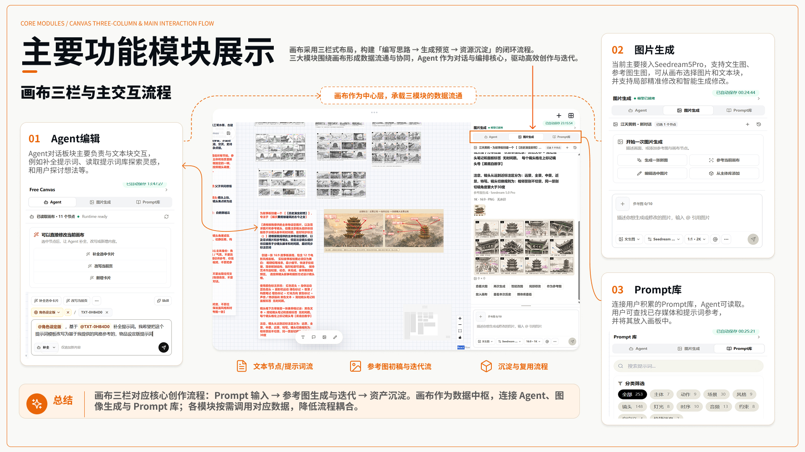
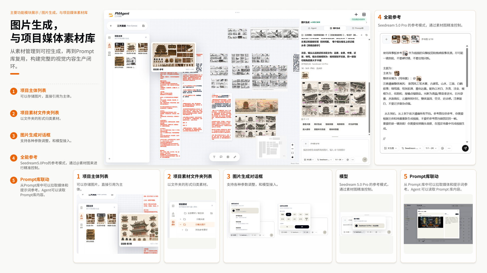
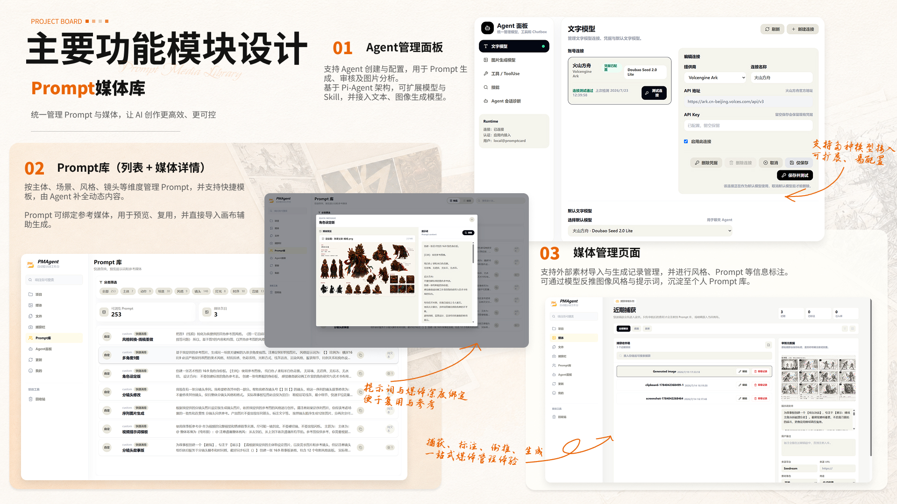
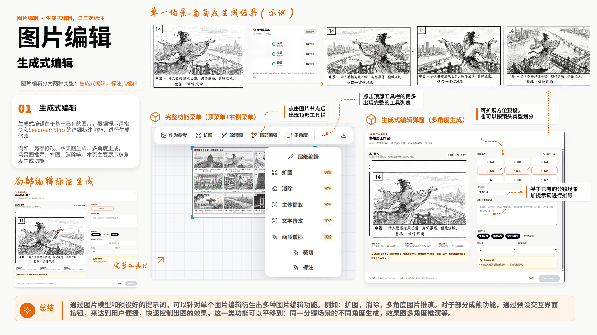
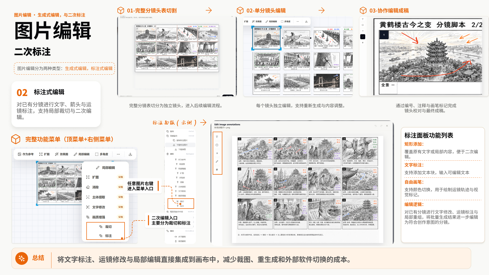
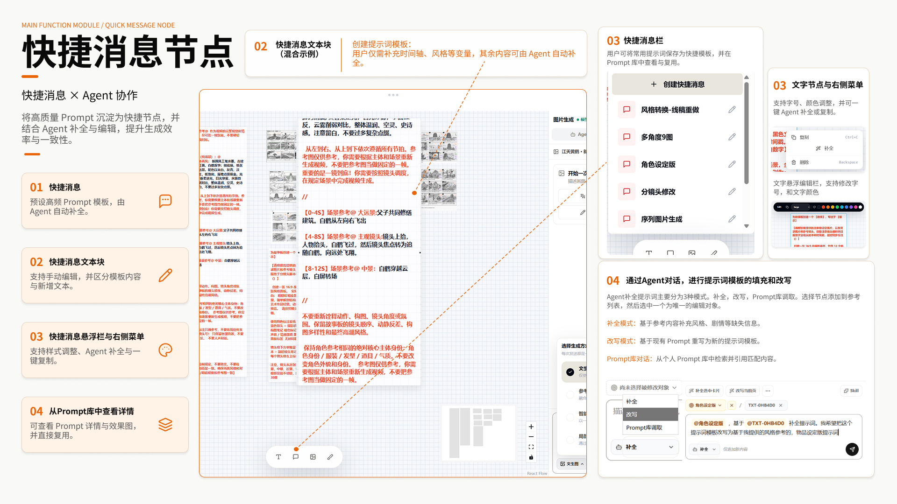
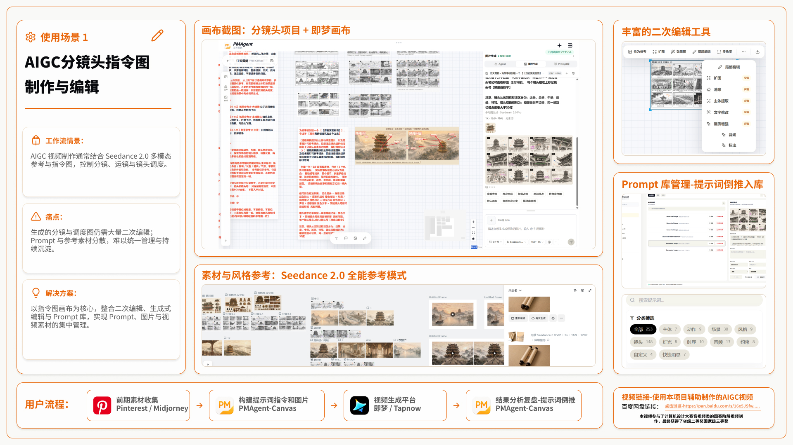
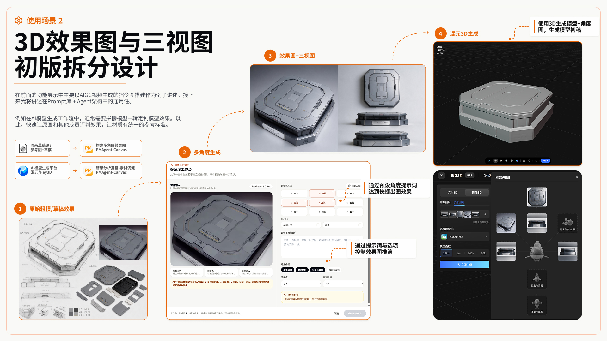
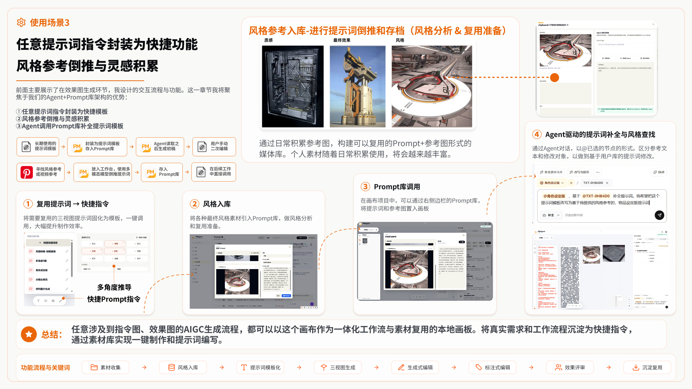

<p align="center">
  
</p>

<p align="center">
  
</p>

<p align="center">
  <a href="#演示视频">演示视频</a> ·
  <a href="#产品总览">产品总览</a> ·
  <a href="#一条完整的本地创作链路">创作链路</a> ·
  <a href="#核心功能">核心功能</a> ·
  <a href="#全能参考式提示词辅助编辑">提示词辅助编辑</a> ·
  <a href="#快速启动">快速启动</a> ·
  <a href="#技术架构">技术架构</a>
</p>

PMAgent-Canvas 是面向 AIGC 创作者的本地桌面创作上下文环境。它让参考素材、Prompt、剧本与分镜、Agent 对话、生成结果、修改决策和复盘经验以可携带的项目资产持续沉淀，而不是散落在聊天记录、生成平台和临时文件夹中。画布是人和 Agent 共同操作这些上下文的工作台，不是产品要与生成平台竞争的终点。

> [!WARNING]
> 当前 `main` 为 **开发版本：不稳定，处于功能测试中**，不建议作为生产稳定版部署。需要稳定基线时请使用 Git tag `stable-2026-08-25`。

当前核心模型：

- **Seedream 5.0 Pro**：图片生成、参考图生成与图片编辑。
- **Doubao Seed 2.0**：持久化 Agent 对话、媒体提示词倒推，以及全能参考式 Prompt 补全与重写。

> [!IMPORTANT]
> 当前仓库提供的是 **Windows 桌面开发预览**。双击 `start-desktop.vbs` 可以启动可编辑源码对应的桌面壳；它不是已签名的免环境安装包。

## 演示视频

[▶ 查看 PMAgent-Canvas Demo 演示视频](./assets/readme/demo/demo-video.mp4)

[▶ 百度网盘在线观看（提取码：6666）](https://pan.baidu.com/s/1Dcmho_NYCCUFW-jZm90L6A?pwd=6666)

## 产品总览

PMAgent-Canvas 的中心是项目上下文，而不是画布本身。左侧管理项目主体与素材，中间以画布呈现文本、分镜、参考图和生成结果，右侧在 Agent、图片生成与 Prompt 库之间切换。人、外部 Agent 和外部创作工具围绕同一份项目状态协作，而不是各自保存一份孤立数据。

<p align="center">
  
</p>

## 一条完整的本地创作链路

从参考素材和剧本进入项目，到 Agent 形成结构化创作资产，再到图片生成、二次编辑和资产归档，所有关键上下文都留在本地项目中。用户可以把确定的镜头、参考图和执行说明带到外部创作工具，再把结果回挂到原项目继续审阅和迭代。

<p align="center">
  
</p>

PMAgent-Canvas 不试图替代每一个外部生成、剪辑或 3D 平台，也不把模型聚合当作核心竞争。它更关注生成前后的生产资料：参考图、分镜、Prompt、模型参数、生成结果、修改方向和复盘经验，让这些内容能被人和外部 Agent 精确读取、审阅、复用和交付。

## 核心功能

### 图片生成与项目媒体素材库

在画布中调用 Seedream 5.0 Pro 完成文生图、参考图生成和图片编辑。生成结果进入当前项目媒体库，可以继续加入画布、绑定参考关系或参与下一轮生成。

- 项目主体和项目素材分层管理。
- 支持多张参考图、比例与分辨率设置。
- 可从 Prompt 库拉取媒体和提示词上下文。
- 生成历史与项目资产持久化保存。

<p align="center">
  
</p>

### Prompt 库与媒体管理

Prompt 不再只是一次性的文本。PMAgent-Canvas 将提示词、参考媒体、分类、来源和项目用途放在一起，既可供用户检索，也可由 Agent 在明确权限范围内读取和提出新增建议。

- 按主体、动作、场景、风格、镜头、灯光等维度分类。
- Prompt 与参考媒体深度绑定，便于在项目中复用。
- 媒体管理页记录生成、截图和导入的项目素材。
- Agent 写入采用用户确认的提案边界。

<p align="center">
  
</p>

### 图片编辑、切割与二次标注

围绕已有图片继续创作，而不是在每次修改时丢失原始上下文。Seedream 5.0 Pro 负责生成式修改，画布工具负责裁切、拆分、文字和箭头标注。

- 局部修改、多角度生成、扩图、消除与场景图推导。
- 按辅助线切割分镜板或多图素材。
- 添加文字、箭头和区域标注。
- 编辑结果继续回到画布和项目素材中。

<p align="center">
  
</p>

<p align="center">
  
</p>

### 快捷消息节点与 Agent 协作

快捷消息节点是一类可沉淀、可编辑的提示词模板。用户可以在画布中调整内容与样式，也可以从 Prompt 库查看完整上下文，再由 Agent 在规则范围内补全和改写。

<p align="center">
  
</p>

## 全能参考式提示词辅助编辑

Canvas Agent 将图片生成中的“全能参考”关系带到文本提示词编辑：先指定一个被编辑目标，再挂载多个只读参考，通过 `@节点` 明确描述目标与参考之间的关系。节点正文不会被塞进输入框，用户可以在保持对话清晰的同时组织复杂 Prompt 上下文。

- **一个目标、多个参考**：最多挂载 10 个文本节点；左侧唯一目标可写，其余节点始终只读。
- **原子化 `@` 引用**：输入 `@` 只显示已挂载节点，可以表达“以 `@目标` 为修改对象，参考 `@风格` 和 `@镜头`”等关系。
- **补全模式**：Agent 先识别原文缺口，再用精确锚点在目标内部穿插黑色用户段；原文字、颜色和顺序保持不变。
- **重写模式**：生成一个位于原节点右侧的完整派生文本节点；原节点始终不变，便于并排比较。
- **Prompt 库调取模式**：普通对话不加载 Prompt Library；只有显式切换到该只读模式时，Agent 才会基于当前对话搜索 Prompt 与关联媒体，不产生 Canvas 写入提案。
- **模板保护**：模板段只用于语义与结构参考，Agent、Gateway 和提案应用层都不允许修改。
- **先预览再写入**：结果以差异提案显示；节点 revision、模板摘要、用户内容摘要或选区发生变化时，旧提案会被拒绝。
- **稳定节点身份**：文本节点使用 `TXT-XXXXXX` 默认名称，可在画布顶部工具栏重命名；画布标签和 `@` 列表同步更新。
- **持久化聊天视图**：会话历史在独立滚动区域中显示，用户消息靠右、Agent 消息靠左，便于持续讨论与回看。
- **会话级模型选择**：每个会话从设置页白名单中选择自己的对话模型，重启后恢复，并记录每轮实际模型快照。

详细交互、安全边界与请求协议见 [Canvas Agent 全能参考式提示词编辑](./docs/frontend/canvas-agent-reference-editing.md)。

## 使用场景

### AIGC 分镜头指令图制作

把前期收集的素材、分镜 Prompt、参考图和生成结果放进同一块画布，完成从指令图搭建、外部平台生成到结果复盘的闭环。

<details open>
  <summary><strong>查看完整案例：分镜头指令图制作与编辑</strong></summary>
  <br>
  
</details>

### 3D 效果图与初版拆分设计

将三视图、材质参考、风格样本和多角度生成结果组织为可复用模板，再通过生成式编辑与标注完成细化和评审。

<details open>
  <summary><strong>查看完整案例：3D 效果图与初版拆分设计</strong></summary>
  <br>
  
</details>

### 提示词模板化、风格参考与灵感积累

将反复使用的提示词封装为快捷模板，把风格参考沉淀到 Prompt 库，再由 Agent 调用、补全和改写，形成从灵感积累到复用交付的一体化工作流。

<details open>
  <summary><strong>查看完整案例：提示词模板化、风格参考与灵感积累</strong></summary>
  <br>
  
</details>

## 快速启动

### 环境要求

当前一键启动路径面向 Windows 开发环境。首次启动前请确保以下工具可用：

- Node.js 与 npm
- `uv`（Python 运行时和依赖同步）
- Rust / Cargo（首次构建或 Tauri 源码发生变化时使用）

### 启动桌面壳

```powershell
git clone https://github.com/Aoye-3/PromptCard-Agent.git
cd PromptCard-Agent
```

然后在资源管理器中双击：

```text
start-desktop.vbs
```

启动器会在需要时安装前端依赖、初始化本地服务并打开 PMAgent-Canvas 桌面壳。正常启动会复用现有桌面进程；Rust 或 Tauri 源码变化时会触发重新构建。当前组合启动链路会校验 Storage schema v19，避免把旧 Storage 进程误当作可用服务。

如果启动失败，运行可见终端版本查看完整日志：

```powershell
.\start-desktop.bat
```

### 配置核心模型

打开桌面壳后，在 **Agent 面板 → 模型管理** 中配置连接并绑定模型：

| 能力槽位 | 当前核心模型 | 用途 |
| --- | --- | --- |
| 文本 / Agent | Doubao Seed 2.0 | 持久化对话、媒体提示词倒推、Canvas Prompt 补全与重写 |
| 图片生成 / 编辑 | Seedream 5.0 Pro | 文生图、参考图生成与图片编辑 |

模型凭据由后端写入操作系统密钥环，不进入浏览器存储、项目 JSON、生成历史或 API 响应。未配置凭据时，模型调用会返回 `credential_missing`。

方舟连接只录入一个推理 API Key。设置 `chat.primary` 后，在同一连接的“项目 Agent 可用模型”中勾选允许出现在会话选择器中的官方目录模型。目录由应用版本维护；Ark Runtime SDK 使用该 Key 调用明确的模型 ID，但不通过同一推理凭据发现账号模型。

## 本地项目与数据边界

- 项目数据、画布状态、Prompt、生成历史和素材索引保存在本地持久化存储中。
- 图片结果不会因为删除画布节点或项目视图而直接删除底层历史资产。
- Agent 面板、Prompt 库、画布与媒体分析使用隔离的会话上下文。
- Prompt 库和画布写入采用显式提案与用户确认，不让 Agent 静默覆盖生产资料。

## 技术架构

| 层级 | 当前实现 |
| --- | --- |
| 桌面壳 | Tauri 2 |
| 前端 | Vite、React、TypeScript、Tailwind CSS、Zustand |
| 画布 | React Flow + PMAgent 自有媒体层 |
| 本地存储 | SQLite + 项目资产目录 |
| Agent Runtime | Python PromptCard Gateway + pi text Agent |
| 模型管理 | Provider-neutral connection 与模型槽位绑定 |

更完整的工程资料：

- [技术文档入口](./docs/README.md)
- [系统架构](./docs/architecture/system-architecture.md)
- [Agent Runtime 边界](./docs/architecture/agent-runtime-boundary.md)
- [Agent Runtime API](./docs/api/agent-runtime-api.md)
- [前端应用结构](./docs/frontend/app-shell.md)
- [Canvas Agent 全能参考式提示词编辑](./docs/frontend/canvas-agent-reference-editing.md)
- [图片生成与模型管理](./docs/architecture/image-generation-and-model-management.md)

<details>
  <summary><strong>开发命令</strong></summary>

```powershell
npm.cmd run dev
npm.cmd run dev:with-agent
npm.cmd run agent:dev
npm.cmd run text-agent:dev
npm.cmd run agent:check
npm.cmd run mcp:stdio
npm.cmd run mcp:http
npm.cmd run mcp:check
npm.cmd run test:mcp
npm.cmd test -- --run
npm.cmd run test:frontend
npm.cmd run test:e2e
npm.cmd run build
```

Backend Agent Runtime tests:

```powershell
cd agent-runtime/backend
& .\.venv\Scripts\python.exe -m pytest tests -q -p no:cacheprovider
```

PromptCard Storage release gate (the script resolves the repository root and uses its existing virtual environment so image-codec dependencies are available):

```powershell
npm.cmd run storage:test
```

</details>

## 规划中功能

### 可携带的跨平台创作上下文

产品方向是把 PMAgent-Canvas 建设为连接创作者、外部 Agent 与外部创作工具的上下文层。项目中的剧本、角色与场景设定、参考素材、结构化分镜、镜头执行信息、生成结果、批注和版本决策应当保持可定位、可审阅、可复用，而不是被锁在某一个聊天客户端或生成平台里。

- **当前优先级：稳定 Local Agent Bridge / MCP。** 外部 Agent 通过受控的本地 Bridge 读取、创建和更新明确的项目对象，并返回用户可预览、可采纳的变更提案；它不依赖嵌入某一家 Agent 聊天界面。
- **首个产品闭环：剧本与参考 → 结构化分镜 → 人工定点审阅与修改 → 可执行镜头资产包。** 镜头是下一阶段重点收敛的创作对象，用于连接剧本文段、角色/场景、参考图、提示词、生成结果、批注与版本，但不授权泛化的 Canvas 更新接口。
- **后续资产出口：Asset Shelf（创作资产架）与连接器。** 用户继续使用现有浏览器和外部创作工具；PMAgent-Canvas 在旁边提供可检索的项目资产，优先支持可靠的文件/图片拖出、文本复制和执行包导出，再针对少量高价值平台渐进式提供填入与结果回流。

完整的分期、决策记录和最终验收证据已合入 `main`；本 README 与技术文档共同维护已确认的产品方向、边界和当前能力。

### PromptCard Local Agent Bridge 与 Prompt 库 RAG

贡献者和本地使用者请从 [Local Agent Bridge 与 MCP 运维指南](./docs/operations/local-agent-bridge.md) 启用：首轮只读配置不需要任何模型供应商密钥，启动器不会下载运行时；Codex 已通过真实闭环验收，TRAE 仍是未验证候选，不作为兼容性声明。

当前已经完成 Skill Hub 管理工作流、宿主中立的 Bridge v1/v2 合同边界，以及承载 Document、Storyboard、Prompt 与图片提案的 Bridge v3 合同。Storage v19 在 v18 事务化 Prompt FTS5 检索与稳定 `CVD-*` / `CVS-*` 外部引用之上，增加统一的 profile-scoped 写回账本；独立凭据保护的 Gateway、确定性 JSON CLI 和 repository-owned MCP 已能让外部 Agent 从明确选择的 `PRJ-*` / `CVC-*` 工作上下文发现对象、精确 Skill pin、带 revision/digest 的 Prompt 证据及明确授权的媒体，并通过同一合同提交、排队和查询待审阅的创作提案。

- 外部 Agent 应用是创作入口；PMAgent-Canvas 不内嵌某一家的聊天界面，也不按客户端名称分叉核心工具、schema、权限或结果。
- MCP 已支持本地 STDIO 与仅监听 `127.0.0.1` 的 Streamable HTTP，并覆盖 2025-11-25 与 2026-07-28 两个协议时代；不实现旧 SSE。Codex 是本轮首个真实验收宿主，TRAE 保留合同兼容覆盖，不作为本轮人工验收门槛；豆包与 MarsCode 暂标“待验证”。
- Prompt 库媒体和画布媒体采用独立编码、索引、权限与生命周期；即使复用同一底层资产，也不共用业务编码。
- Agent 生成结果只通过 Gateway/Storage 导入，不直接修改项目 JSON、SQLite 或资产目录；Bridge 使用独立凭据与受限 scope，不能复用内部全权令牌。
- 左侧全局 **Skill Hub** 已支持惰性导入预审、结构化发现、revision 历史与 diff、精确 revision 信任审阅、archive/restore，以及 Codex/local-Agent 独立 pin 和显式投影修复。
- Codex `.agents/skills` 是一个准确命名的具体 Host Adapter；canonical revision 更新不会自动移动 Codex 或 local-Agent pin。
- Skill 导入只读取与校验包，不执行其中的脚本、安装器、hook 或依赖；本地 Agent 只读取受限的指令与文本参考资料。
- Canvas 的右侧栏现已将连接状态、受信 profile 与固定 scope、明确 PRJ/CVC、Bootstrap Skill、精确 Skill pin、Tool/写回能力、待审阅提案和近期失败集中为一个 **Agent 工作环境**。Bootstrap v6 由 Runtime 直接返回可执行上手说明，不再只是名字和 digest；它给出 fresh CVC、四字段 Skill pin、六类封闭写回形状、图片 staging 的精确六字段输入及 preview→commit→人工审阅规则。精确 CVD 解析还会返回有界的块文本、UTF-8 长度与摘要，让外部 Agent 能构造冲突安全的 `document.change`，无需猜字段或自行计算摘要；Storyboard 创建与修改的完整 sequence/row 字段和 `payload.changes` 也被明确冻结。创建 CVC 前会先强制持久化当前 Canvas，并使用 Storage 返回的权威项目 revision；无新编辑的空闲自动保存不再重复推进 revision。真实 Gateway/Storage/浏览器检查点、真实 Codex MCP 首次发现，以及真实 Codex Document 创建/修改、Storyboard 创建/逐字段修改、Prompt 创建和图片写回均已通过原生可视化审阅与持久化验收。最新总链使用实际 Codex 图片能力从已接受 Prompt 生成 PNG，在用户显式多选 Prompt 与 Storyboard 后创建双对象 CVC，再由新 Codex 进程完成受控 `AST-*` staging、镜头 0 定位、图片提案和唯一 `CVM-*` 保存；Storage 同时证明没有产生 provider generation run。随后停止并重启 Storage、Gateway、Vite 和 Codex 后，新 Codex 按完全相同的 staging 与六组 preview/commit/status 参数完成幂等重放，不产生重复 `CVD-*`、`CVS-*`、`CVT-*` 或 `CVM-*`，同 key 不同 digest 明确返回 `delivery_conflict`，新浏览器也恢复四类对象、来源和接受状态。真实闭环还暴露并修复了外部写回节点按 20×16 偏移而互相遮挡的问题；Bridge 新建节点现使用保守的无碰撞槽位，普通手动节点布局保持不变。
- `main` 已完成只读 Gateway、Storage v18 检索、local-Agent RAG、repository JSON CLI、Storage v19 统一写回账本，以及同一 Gateway 之上的十工具 MCP。新增的 `promptcard_delivery_preview`、`promptcard_delivery_commit`、`promptcard_delivery_status` 与 `promptcard_asset_stage` 对 Codex 和其他 MCP 宿主保持相同 schema 与结果；文件 staging 只允许配置的 workspace root 内真实文件，拒绝路径穿越和 symlink/junction 逃逸。外部 Agent 的 preview/commit 只产生待审阅提案；Prompt 接受后先保存全 `user` 节点并取得 `CVT-*`，图片则先经 30 MB、MIME、摘要和路径边界校验进入不透明 `AST-*` staging，再由 Canvas 保存普通图片节点并取得 `CVM-*` 后确认。两类流程都可安全重试，不重复建节点；图片写回不会伪造 provider generation run。Task 26A 的 Document create/change 与 Task 26B 的 Storyboard create/change 均已通过真实 Gateway、Storage 与浏览器 Canvas 闭环。Document 创建复用原生 AST，修改只按 `CVD/revision/digest` 定点转换为既有红删绿增建议；Storyboard 创建保留精确来源 Document 证据，修改只按 `CVS/revision/digest` 和外部 row ordinal 转换为既有逐字段差异。两类结果都必须先保存并取得 Storage 所有的稳定代码，才确认 ledger。Storyboard CVC 只额外公开已有待审阅字段的 `scope/rowOrdinal/field` 身份，不泄露内部行、编辑或建议 ID，并在新修改命中同一字段时 fail closed。默认真实进程测试已覆盖创建、修改、审阅、重放和唯一结果；两阶段服务重启测试还证明已接受 Document、已接受 Storyboard、待审阅字段修改、来源、状态与 UI CVC 偏好可恢复。真实 Codex 总闭环与最终发布矩阵均已通过。

本地 Agent 与 MCP 现已复用同一个有界、可引用、可审计 Prompt 检索核心，但保持会话、身份与权限隔离。Plan 008 的 Tasks 15.6–15.10 自动化结果保留为回归基线，Task 19 已再次确认连续消息、丢失响应重放和重启 hydration；原 Checkpoint 3.5 人工探针已并入最终真实 Codex 闭环。详见 [Plan 008 执行台账](./docs/superpowers/plans/2026-08-22-plan-008-execution.md)、[ADR-023](./docs/decisions/ADR-023-typed-creative-writeback-and-agent-workspace.md) 与 [Plan 009](./docs/Plan/009-portable-creative-context-environment.md)。

## 未来设想（暂无计划）

以下内容仅记录可能的产品方向，尚未进入正式 Plan，不代表已经排期、确定接口或承诺实现。

### 插件节点 Hub

远期规划在自由画布中加入 **插件节点 Hub**，统一承载可发现、可安装、可版本化并可按项目启用的扩展节点。插件节点 Hub 面向画布能力扩展，与管理 Agent 指令包的 Skill Hub 保持独立边界。

首批插件节点计划按以下顺序探索：

1. **357 头身角色基膜库**：围绕 3、5、7 头身比例组织可复用的角色基膜，为角色设定、姿态设计和后续视觉生成提供一致起点。
2. **基于前端 3D 代码的线稿风格场景生成**：使用前端 3D 代码搭建和调整场景结构，再将视角、构图与空间关系转换为可继续创作的线稿风格场景结果。
3. **Asset Shelf 与浏览器连接器**：作为外部工具旁的资产架，优先让用户拖出文件/图片、复制结构化文本或导出镜头执行包；只在有明确价值和兼容性验证的平台提供渐进式填入与结果回流。它不内嵌或接管浏览器，也不承诺对任意网页可靠地拖放文本。登录状态、网站兼容性与权限边界将在进入正式连接器 Plan 后单独定义。

### 编剧 Agent Skill 与情绪曲线脚本工作台

在 Skill Hub 接入并稳定后，可进一步引入面向短片创作的编剧 Agent Skill，并设计一套可视化的情绪曲线脚本界面：围绕剧情节点、场景、角色状态和节奏变化组织本地短片脚本创作。标准化短片脚本可继续转换为设定图、分镜图等视觉资产，并通过资产表统一管理角色、场景、道具、镜头、参考素材、Prompt、生成结果及其来源关系。

## 当前状态

PMAgent-Canvas 仍处于活跃开发阶段。受控 Local Agent Bridge / MCP 的真实 Codex 四类写回、可视化审阅、相同请求幂等重放、不同摘要冲突拒绝、服务与宿主重启恢复已经通过。Phase 6 的统一对抗性边界门禁也已通过：它覆盖跨项目/跨上下文访问、撤销 CVC、失信或归档 Skill、scope 伪造、路径与 junction 逃逸、MIME/摘要欺骗、重复/崩溃重放、错误脱敏以及 MCP 缺席时的普通 Canvas/Agent 启动回归；真实 Gateway 攻击链还促使无效凭据响应统一为稳定的 `bridge_credential_required`。可选 Bridge 启动器、只读/全审阅配置模板、贡献者诊断、宿主状态和移除说明，以及全仓构建、回归、浏览器、安全与文档发布矩阵均已通过。浏览器连接器与 Asset Shelf 不在本轮范围。对外使用前请以仓库中的实际实现和技术文档为准。
