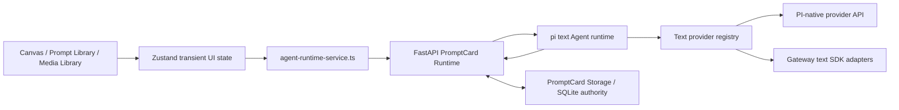

# Text Agent Runtime Boundary

PromptCard uses a small, product-owned boundary around a focused text Agent. DeerFlow and LangGraph are not part of the maintained runtime.

## Architecture

The split is deliberate:

- The Python Gateway owns browser session/CSRF handling, model connections, keyring credentials, Storage access, secure PI-native forwarding, image generation, and SDK-specific text adapters.
- The Gateway owns project-conversation coordination: it validates project/entrypoint/mode, loads bounded history from SQLite, injects current workspace and Skill snapshots, and persists each idempotent turn.
- The Node text runtime owns the pi agent loop, PI provider collection, Prompt Library search, and proposal tools. It is request-driven and does not keep authoritative session memory.
- The frontend owns user approval and applies proposals through existing Canvas or Prompt Library state handlers.
- PromptCard Storage is the sole durable authority for project Agent conversations, messages, proposal status, and Skill revision audit records.
- Image generation remains an independent Gateway module and does not depend on pi.

## Minimal Closed Loop

The first product milestone is:

1. Build and maintain the Prompt media library.
2. Generate images from Canvas prompts.
3. Use the text Agent to analyze prompts and complete or write prompts.

The text Agent supports the third step without becoming a general-purpose autonomous Agent.

## Canvas Contract

- Canvas editing requires one explicitly attached target text node. Up to nine additional attached text nodes are read-only references; `@` mentions express relationships but do not grant write permission.
- `complete` exposes only the mode-locked `emit_canvas_prompt_edit` insertion schema. Valid output becomes `free_canvas_text_insertions` for the exact target, with at most 16 unique segment/text anchors.
- Completion preserves every original character, segment order, source, and color. Approval only inserts black `user` segments at the validated anchors.
- `rewrite` exposes the same tool name with a different schema that accepts one complete `userText`. Valid output becomes `free_canvas_text_create`; approval creates a derived node to the source node's right and never changes the source.
- New proposals carry `baseNodeRevision`, `templateDigest`, and `baseSegmentsDigest`. Gateway and the apply path reject the whole proposal when any basis or anchor is stale.
- The built-in `canvas-prompt-editor` revision 3 is bound by `canvas.prompt.edit`, but target locking, reference immutability, tool schemas, and approval checks remain Gateway/application policy rather than Skill-granted authority.
- Prompt Library content is not included in ordinary Canvas discussion or edit calls. It is available only in the explicit `prompt-library` mode, which exposes search but no Canvas mutation tool.
- The frontend must show Apply and Reject controls. No Agent response writes to Canvas automatically.

## Prompt Library Contract

The Prompt Library Agent may search the provided snapshot and emit only additive `prompt_library_write_proposal` records with `operation: "create"`. Update, overwrite, archive, and delete are outside the Agent tool surface.

## Media Analysis Contract

The Media Library's temporary collaboration dialog calls `POST /api/promptcard/runtime/media-analysis`.

- MVP input is one explicitly selected image asset.
- The browser keeps at most 40 temporary user/assistant messages and resends them on every turn. Closing the dialog discards them; neither SQLite nor `localStorage` stores this history.
- The Gateway reloads that asset from PromptCard Storage on every turn and passes only that image to the multimodal text model.
- Ordinary `chat` turns discuss the material without producing a structured Prompt. Only explicit `preview` requests permit `media_prompt_preview`.
- The built-in `media-prompt-reverse` Skill is bound automatically. The preview contains editable name, type, category, content, rationale, and source material identity.
- Selection rewrite returns a local candidate. The UI shows the before/after text and replaces the selected range only after confirmation.
- Writing to Prompt Library is a separate explicit user action through the existing Recent Capture registration transaction. The Agent has no direct Storage-write tool.
- Video analysis is deferred. The request boundary is intentionally media-item-scoped so video can be added later without changing Canvas or image-generation contracts.

## Persistent Conversation And Skill Contract

- Persistent project calls use `conversationId + requestId`; `(conversationId, requestId)` is idempotent in Storage.
- The Gateway refuses a conversation when its `projectId`, `entrypoint`, or `mode` differs from the request.
- Each conversation persists a nullable model binding. New conversations adopt the available `chat.primary`; subsequent turns resolve the saved binding against the current connection whitelist and readiness state.
- Every first execution records the actual connection, provider, model, display name, and capability snapshot. An idempotent retry returns that stored turn even if the conversation's selected model later changes.
- Conversation list, rename, Trash, restore, and permanent deletion are project-scoped. Permanent deletion cascades its messages, turns, and proposals.
- The current `localStorage` entry remembers only the selected conversation ID. Composer drafts are component state; browser storage is never a message-history authority.
- Built-in Skills are selected by stable capability ID. External Skills are chosen explicitly and apply to one message only.
- Every injected snapshot resolves the enabled local-Agent host pin and records its exact `skillId`, immutable revision, and digest. It never falls back to the Skill's mutable current revision.
- Storage rechecks active lifecycle, trust, content budget, and declared capabilities on every snapshot read. Instructions and bounded text references are allowed; scripts/assets are never sent to the model or executed.
- Gateway independently validates the returned shape, public `SKL`, digest, UTF-8 budgets, reference paths/content types, and capabilities. Declared tools must be a subset of tools already allowed by `permissionScope`; any non-tool capability, missing pin, unavailable snapshot, or privilege expansion fails before model invocation.

## Safety And Coupling Rules

- Browser code calls only `/agent-api/promptcard/runtime/*`.
- Gateway-to-pi and pi-to-Gateway calls require `X-PromptCard-Internal-Token`.
- Credentials remain in the operating-system keyring; the browser and pi runtime never receive them.
- pi tools produce proposals only. They have no filesystem, shell, provider credential, Canvas write, or Storage write capability.
- Persistent conversation reuse is rejected when `projectId`, `entrypoint`, or `mode` changes.
- Skill content cannot expand permissions, proposal kinds, network access, filesystem access, or approval rights.
- Project-Agent model calls use the binding loaded from the owning conversation, never an arbitrary browser model ID. `chat.primary` is only the initial/default binding; the runtime never contains a fixed Ark model constant.

## Provider and modality boundaries

Model connections are shared account metadata; invocation and assignment remain modality-specific.

- `PI 原生` text models are registered with pi `createProvider`/`createModels` and use the provider's PI API implementation. The Gateway forwarding boundary injects the keyring credential, so Node receives only an internal token and a non-secret descriptor.
- `方舟 SDK` text models are registered as a separate pi provider family whose stream delegates to the Gateway text-SDK registry. The Ark implementation is one adapter behind that registry.
- Image models never enter either text path. Image generation continues through `image_generation` provider adapters and the `image.primary` assignment.
- The text selector groups `PI 原生` before SDK families. The image selector shows SDK families only and filters out every chat model before rendering.

The project turn request carries the Gateway-resolved non-secret model descriptor into the Node runtime. Internal text-model responses contain connection ID, provider ID, model capabilities, and integration group; they never contain an API base or credential. PI-native provider traffic uses the authenticated `/internal/pi-proxy/{connectionId}/...` route and replaces incoming authorization with the stored credential.

Adding a text integration follows one of two paths:

1. PI-native: add provider/catalog metadata and select the matching PI API implementation.
2. SDK-backed: add provider/catalog metadata plus one `TextProviderAdapter` registration in the Gateway.

Neither path requires a Canvas contract change or an image-generation adapter change.

## Local Runtime Contract

`npm.cmd run dev:with-agent` starts or reuses four processes and writes schema version 2 to `logs/dev-runtime.json`:

- Vite frontend
- PromptCard Storage
- Python Gateway
- pi text Agent

The manifest includes `textAgentUrl` and `textAgentHealthUrl` in addition to the existing frontend, Gateway, and Storage URLs.

The runtime-manifest schema and Storage schema are independent. PromptCard Storage currently reports schema v16. Direct Storage/Gateway test gates use the v16 implementation.
