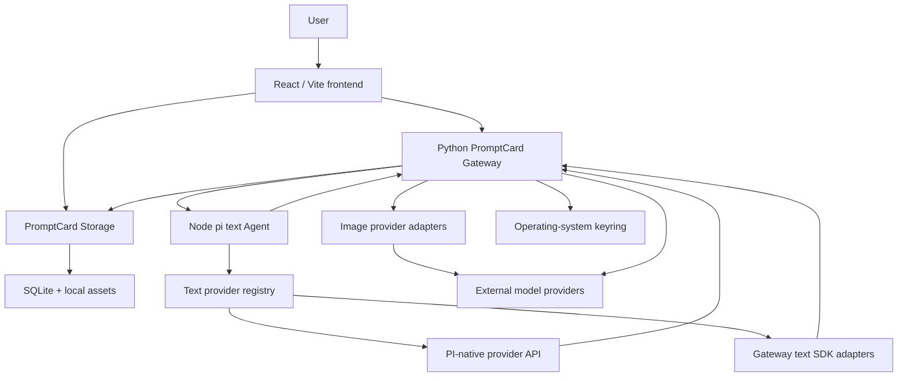
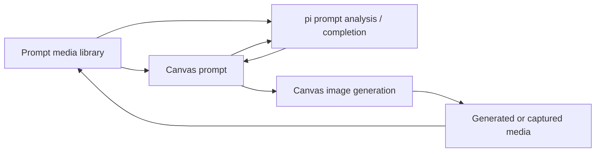

# System Architecture

## Overview

PromptCard-Manager is a local-first prompt and visual-production application. Durable projects, Prompt Library items, media assets, and image-generation history belong to PromptCard Storage. Text-Agent orchestration is intentionally separated from provider access and from frontend writes.

## Runtime Topology

## Ownership

- Frontend: interaction state, Canvas selection, pending proposal/field/suggestion review UI, atomic project save plus apply marker, and existing Canvas/image-generation components.
- PromptCard Storage: projects, Prompt Library, media assets, captures, image conversations, immutable runs, placements, derivatives, project document resources, Agent apply-ledger evidence, and provider-file cleanup retries.
- Python Gateway: browser session and CSRF boundary, model catalog/connections/assignments, keyring access, secure PI-native forwarding, SDK-backed text adapters, media loading, and the independent image-generation lifecycle.
- pi text runtime: request-scoped normalized history, PI provider collection, prompt orchestration, Prompt Library search, and proposal-only tools. It does not own durable conversation state.

## Minimal Closed Loop

## Text-Agent Flow

1. A Canvas, Prompt Library, or Media Library surface sends a bounded request through `agent-runtime-service.ts`.
2. Vite proxies `/agent-api` to the Python Gateway.
3. For a project conversation, Gateway validates the project, entrypoint, mode, permission scope, `conversationId`, and idempotent `requestId`, then loads bounded SQLite history. Media requests instead carry bounded component-memory history and are never persisted.
4. Gateway binds the feature Skill plus either one-shot Prompt-edit Skills or the experimental conversation's persisted Skill IDs, resolves every current exact local-Agent pin, rejects unavailable tool dependencies, and forwards normalized history, current workspace context, Skill snapshots, and the permitted tool catalog to the stateless pi Runtime using an internal token.
5. pi can search Prompt Library only in the explicit `prompt-library` mode and can emit only tools allowed by the request policy.
6. For persistent project chat, Gateway resolves the conversation's whitelisted model binding and sends its non-secret descriptor to pi. `chat.primary` initializes a conversation but is not reselected on every turn.
7. PI-native models stream through the credential-injecting Gateway proxy; SDK-backed models use the separate Gateway text-adapter registry.
8. Gateway validates the result again and durably records project messages, tool summaries, proposal state, and the exact Skill revision/digest used.
9. Pending Prompt/Prompt Library proposals remain Apply/Reject operations. An explicit planning action may return one enriched Document/Storyboard Canvas edit; the frontend saves its reviewable state and marker atomically, then Gateway verifies Storage before recording `applied`.

## Canvas Proposal Rules

- Explicit Canvas node context: at most one attached text node is the writable target; all other attached text nodes are read-only references. `@` mentions express relationships and do not grant write access.
- Completion mode accepts at most 16 exact segment/text anchors and produces `free_canvas_text_insertions`; approval preserves every existing segment and adds only black user segments.
- Rewrite mode produces a complete `free_canvas_text_create` derived node to the source node's right. It does not replace the source or use a text selection.
- Proposals record the target node revision, template digest, and segment digest. The apply path fails closed when any baseline or anchor changes. Explicit Canvas context without a target is discussion-only.
- Prompt Library: additive preset creation only.
- Media analysis: ordinary chat or a non-mutating Prompt preview for one selected image. Prompt Library registration always requires a separate explicit user action.
- Creative documents: explicit Document create/change, Document -> Storyboard, Storyboard field change, and selection/shot -> Prompt handoff only. Ambient context carries bounded Document metadata/excerpts, never implicit full bodies or Prompt/image inputs.

## Image-Generation Isolation

Image generation remains a separate Gateway module using `image.primary`. Image models never enter the PI text provider collection or the text-SDK registry. It does not depend on text-Agent availability. The current Storage schema is v18: it preserves the image-generation conversations and durable placements introduced in v4, the original/derived image relationships introduced in v5, the later asset-lifecycle and project-resource additions, and the v8-v9 text-Agent conversation, Skill, and model-binding tables. Versions 10–18 add public references, immutable context packs, canonical Skill packages, exact host pins, projection recovery, exact-revision trust reviews, project document/provider-cleanup tables, typed creative references, and transactional Prompt retrieval without changing image-run lifecycle. Image runs remain immutable, and Recent Capture behavior remains unchanged.

## Local Port Discovery

`scripts/dev-port-runtime.ps1` writes schema version 2 to `logs/dev-runtime.json`, including:

- frontend URL and port;
- Python Gateway URL and health URL;
- pi text Agent URL and health URL;
- Storage URL and health URL.

Browser code continues to use `/agent-api` and `/storage-api`; only launch/proxy configuration knows concrete ports.

## Deferred

- video media analysis;
- typed Bridge delivery, visual proposal review, and the final real-Codex acceptance loop;
- production multi-user authentication;
- general Canvas write tools, automatic Skill matching, local OCR, and asset/plugin node types.
