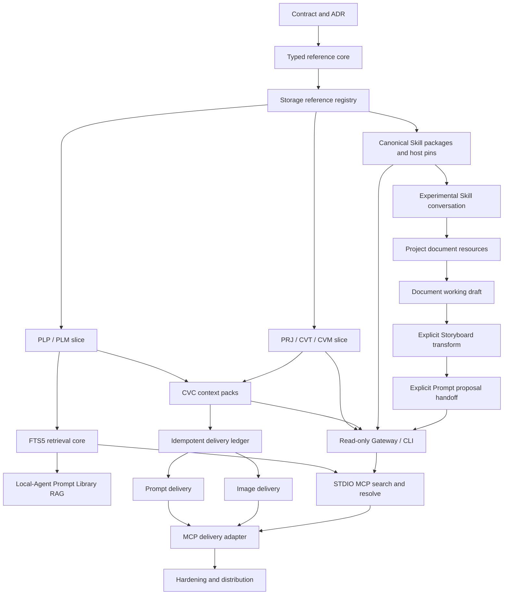

# Plan 008 Execution Plan: Local Agent Bridge, RAG, Skills, And Additive Delivery

> Execution plan for [Plan 008](../../Plan/008-local-mcp-prompt-media-codex-bridge.md). This document converts the long-term product plan into small, ordered, verifiable implementation tasks.

## Status

- Status: `Tasks 16-26 complete; Task 26A Storage, Gateway, and native Canvas Document adapters implemented with process-level replay/recovery verification next; final real-Codex closed-loop gate remains the merge condition`
- Date: `2026-08-31`
- Planning update branch: `docs/document-skill-loop-plan`
- Active execution branch: `feat/skill-document-storyboard-loop`
- Plan 007 prerequisite: manual acceptance confirmed by the user on `2026-08-22`
- Paid live-provider evaluation remains independent and does not block this plan

## Goal

First complete a project-local Skill conversation -> document attachment -> planning Document -> explicit Storyboard -> explicit Prompt proposal loop. Then expose PromptCard's local Prompt Library, Canvas context, canonical Skill packages, Planning Documents, and Storyboards to MCP-capable Agent applications through stable typed references and the host-neutral PromptCard Local Agent Bridge. Accept only idempotent, reviewable Document, Storyboard, Prompt, and image proposals back to an explicitly persisted Canvas context.

Do this without replacing the existing pi text Agent, embedding a third-party Agent chat in PromptCard, granting direct SQLite/filesystem access, or representing bridge-delivered output as a provider generation run.

## Research Summary

### Local architecture findings

The implementation should extend the existing boundaries rather than create a second Agent stack:

- PromptCard Storage is already the authority for projects, Prompt records, assets, Agent conversations, immutable Skill revisions, image runs, and pending placements.
- Gateway already revalidates project scope, Canvas targets, selection digests, attachments, tool permissions, proposal types, and Skill dependencies before and after model invocation.
- text-agent-runtime already compiles a permission-specific policy, but Prompt Library retrieval is still a browser-supplied `200 -> 100` record snapshot with lowercase substring search.
- the current Canvas workspace snapshot is bounded and lossy; it cannot be reused as an immutable `CVC` context pack.
- the existing image placement flow provides the right recovery order: durable pending record, Canvas hydration, project save, then `placed`. Its provider-generation identity must not be reused for Codex delivery.
- the current Skill registry is a useful local-Agent slice, but its `SKL-*` values are internal IDs rather than Plan 008 public ULID reference codes.
- the current Free Canvas `text` node is executable Prompt content with `preset`/`user` segments; reusing it for long-form planning would route Document prose into Prompt semantics.
- current Agent Skill selection is component-local, says “仅作用于下一条消息”, and clears after send; persistent Skill use therefore belongs to a new conversation mode rather than a global behavior change.
- current project resources and asset validation are image/video-oriented, while the Ark Chat Completions adapter accepts text/image only; document resources and file-bearing Ark Responses require separate adapters.
- current node normalization has fallthrough paths that can coerce unknown kinds to Prompt text or media behavior; every Document/Storyboard union dispatch must become explicit before those kinds ship.

Two inferred risks require regression tests before their dependent work:

1. consecutive messages in a newly created Agent conversation may not reuse the Storage conversation ID;
2. a browser retry after a lost response may generate a new request ID and duplicate an already-persisted turn.

These are test-first verification tasks, not assumptions that authorize unrelated refactoring.

### External evidence considered

- [MCP transport specification, 2025-11-25](https://modelcontextprotocol.io/specification/2025-11-25/basic/transports): use STDIO, reserve stdout for JSON-RPC, send logs to stderr, and avoid ambient connection state.
- [SQLite FTS5](https://www.sqlite.org/fts5.html): keep authoritative rows separate from the index, update transactionally, rebuild existing content explicitly, and expose index health.
- [ULID specification](https://github.com/ulid/spec) and [TypeID](https://github.com/jetify-com/typeid): typed prefixes reduce namespace mistakes, while internal primary keys remain separate.
- [Agent Skills specification](https://agentskills.io/specification) and [host implementation guide](https://agentskills.io/client-implementation/adding-skills-support): use progressive disclosure, canonical packages, explicit activation, and host-controlled permissions.
- [Stripe idempotent requests](https://docs.stripe.com/api/idempotent_requests): replay the first result for the same key and request digest; reject reuse of a key with different parameters.
- [What an Anthropic Engineer Thinks About MCP](https://home.mlops.community/public/videos/what-an-anthropic-engineer-thinks-about-mcp) and [One Year of MCP](https://www.latent.space/p/one-year-of-mcp-with-david-soria): prefer explicit state, a small additive tool surface, progressive discovery, and read-heavy initial adoption.
- [Local First FM episode 19](https://www.localfirst.fm/19/transcript): narrow Agent authority by resource and action; preserve an auditable chain of custody.
- [Codex MCP documentation](https://developers.openai.com/codex/mcp): Codex supports local STDIO and Streamable HTTP MCP servers.
- [TRAE MCP FAQ](https://forum.trae.cn/t/topic/65): TRAE supports STDIO, Streamable HTTP, and legacy SSE; this plan uses the first two only.
- [MCP TypeScript SDK v2](https://ts.sdk.modelcontextprotocol.io/v2/): use the split server/Node packages and the 2026-07-28 protocol line.
- [Tiptap persistence](https://tiptap.dev/docs/editor/core-concepts/persistence) and [schema](https://tiptap.dev/docs/editor/core-concepts/schema): persist strict editor JSON and validate the allowed rich-text structure.
- [Doubao Seed 2.0 Lite](https://www.volcengine.com/docs/82379/1795150) and [Volcengine Responses API](https://volcengine.github.io/veadk-python/cn/docs/framework/agent/responses-api/): use file IDs for native PDF understanding, including visual page interpretation.
- [python-docx 1.2.0](https://pypi.org/project/python-docx/): use a pinned local reader for bounded DOCX paragraph/table extraction.

## Architecture Decisions To Freeze

1. **One authority, several adapters.** Storage owns durable identity and state. Gateway owns policy and orchestration. CLI, MCP, local Agent, and host-specific Skill projections are adapters, not alternate databases.
2. **Public code is not a primary key.** Existing IDs remain internal. Every public reference uses `PREFIX-ULID`, is accepted case-insensitively, persisted uppercase, and dispatched by prefix before lookup.
3. **Namespace separation is semantic.** `PLM` and `CVM` may refer to identical bytes but remain different business identities and permission boundaries.
4. **No ambient MCP project.** Every Canvas search, resolve, context, or delivery operation carries an exact `PRJ` or `CVC` reference. UI focus and MCP connection state are never authority.
5. **MCP uses STDIO and loopback Streamable HTTP.** Pin `@modelcontextprotocol/server@2.0.0` and `@modelcontextprotocol/node@2.0.0`, cover the 2025-11-25 and 2026-07-28 protocol eras, and exclude `0.0.0.0`, legacy SSE, first-release OAuth, MCP Apps, Sampling, Tasks, and general filesystem tools.
6. **Schema dialect is JSON Schema 2020-12.** Preserve `contracts/promptcard-bridge/v1/` and `v2/` unchanged. Bridge v3 composes both frozen bases and adds `CVD/CVS`, workspace discovery, staging, and typed creative writeback. Use the explicitly declared validator for all versions.
7. **Tools/Text are the portability baseline.** Exact Tool resolution and optional `promptcard://` Resource Templates call the same Gateway resolver and permission checks; Resources, structured results, and `ImageContent` always have Tool/Text fallbacks.
8. **FTS before vectors.** Phase 4A starts with SQLite FTS5/BM25, revision/digest freshness, fixed budgets, citations, and audit. Semantic retrieval is a later optional slice that requires explicit provider consent and measured value.
9. **Skill projections are rebuildable.** Storage holds canonical immutable packages and host pins. `.agents/skills` and local-Agent snapshots are derived projections and never become the authority.
10. **Bridge delivery has its own profile-scoped ledger.** Reuse asset validation and save-before-placed behavior, but do not reuse provider generation-run identity or provenance. New records use `promptcard-bridge`; v1 `codex-harness` is compatibility-only.
11. **Canonical idempotency name is `clientRequestId`.** The older `deliveryId` example in Plan 008 is treated as illustrative; all additive tool and Gateway contracts use `clientRequestId` plus a normalized request digest.
12. **Client identity is audit-only.** A trusted launcher/authentication context supplies `profileId` and scopes. A request cannot self-report a trusted profile, and client name/version cannot select authorization, schemas, tools, budgets, or behavior.
13. **Planning Documents are not Prompts.** Document and Storyboard use independent Canvas node/data models and never enter Prompt Library, Prompt RAG, Prompt compilation, image-generation input, or ambient full-body context without an explicit typed transform.
14. **Experimental conversation is a top-level mode.** `chat-experimental` is separate from Canvas Prompt edit modes. Only this mode persists conversation-scoped Skill bindings; existing Prompt flows keep one-shot Skill selection.
15. **Project documents stay local; provider files are ephemeral.** Schema v16 adds project document resources. TXT/Markdown/DOCX are normalized locally; PDF uses an isolated Ark Files/Responses path with per-call deletion and durable redacted cleanup retry.
16. **Agent creative writes are narrow and recoverable.** Dedicated Document/Storyboard create/change tools bind exact revisions/digests. Frontend persistence acknowledgement, rollback, request/edit idempotency, and restart reconciliation prevent silent conversation/Canvas divergence.
17. **Transforms require explicit user actions.** Document -> Storyboard and selected Document text/Storyboard shot -> Prompt are the only cross-domain paths in this slice; the latter produces a pending `free_canvas_text_create` proposal for one new all-`user` Prompt Canvas node and cannot update an existing Prompt or read/write Prompt Library.
18. **External creative writeback is typed and proposal-only.** `CVD` and `CVS` are stable external references. Document/Storyboard create/change, Prompt create, and staged image placement share a profile-scoped ledger and independent scopes; every result requires visual acceptance. See ADR-023 and Bridge v3.

## Global Constraints

- Work only in the current repository and in-place Git branch; no worktrees, clones, temporary repositories, or project artifacts on `C:`.
- Preserve existing Prompt, project, asset, Agent conversation, and image-generation compatibility.
- Do not add direct MCP access to SQLite, keyring, project JSON, arbitrary local paths, shell, or package-manager execution.
- Search results are discovery records. Every execution request must contain exact typed codes and server-resolved scope.
- Imported Skill content is untrusted data and is never executed during import, preview, indexing, publication, or local-Agent use.
- Browser and model output are untrusted at Gateway boundaries.
- Every migration is idempotent, preserves Trash/restore semantics, and is covered by backup/restore tests.
- Each task leaves the application buildable and testable. No task silently combines refactoring with a feature slice.
- Tasks 15.6-15.10 remain independent of MCP, Bridge credentials/profiles, and the Bridge delivery ledger. Their automated acceptance is the Phase 4 regression baseline; the deferred manual probes are part of the final real-Codex closed-loop gate.
- Preserve existing Prompt-node, Prompt Library/RAG, image-generation, one-shot Skill, and standalone Storyboard behavior; union extensions require explicit dispatch rather than casts/fallbacks.

## Dependency Graph

## Phase 0: Contract And Decision Freeze

### Task 1: Record the bridge architecture decision

**Description:** Add ADR-018 covering public typed references, the Storage/Gateway/adapter split, separate Codex and local-Agent Skill projections, STDIO ownership, and provider-neutral versus `codex-harness` provenance.

**Acceptance criteria:**

- [ ] ADR explicitly records the eleven decisions above and alternatives rejected.
- [ ] ADR cross-links ADR-008, ADR-012, ADR-016, ADR-017, and Plan 008.
- [ ] The ADR index links ADR-018.

**Verification:** Markdown links resolve; documentation review confirms no claim of implemented runtime behavior.

**Dependencies:** None.

**Files likely touched:** `docs/decisions/ADR-018-local-codex-mcp-contract-boundary.md`, `docs/decisions/README.md`.

**Estimated scope:** Small.

### Task 2: Create the versioned bridge contract package

**Description:** Add the repository-neutral JSON Schema 2020-12 package and manifest for typed references, search results, Prompt bundles, media resources, context packs, Skill packages/revisions/host pins, proposals, deliveries, status, and structured errors.

**Acceptance criteria:**

- [ ] Manifest has one contract version and stable schema IDs consumable by future Gateway, CLI, and MCP adapters.
- [ ] Exact execution inputs accept typed code strings, never search-result objects or internal IDs.
- [ ] Delivery schemas require `clientRequestId`, request digest, exact `CVC`, source-code lists, and additive-only kinds.

**Verification:** Declared JSON Schema validator compiles every schema; `git check-ignore` confirms contract JSON is tracked intentionally.

**Dependencies:** Task 1.

**Files likely touched:** `.gitignore`, `contracts/promptcard-bridge/v1/manifest.json`, `contracts/promptcard-bridge/v1/schema.json`, `contracts/promptcard-bridge/v1/README.md`, package dependency metadata.

**Estimated scope:** Medium.

### Task 3: Add positive and negative contract fixtures

**Description:** Add fixtures for success, unknown code, trashed media, revoked context, invalid Skill package, independent host pins, duplicate requests, digest conflict, revision conflict, namespace mismatch, ULID overflow, and search-result substitution.

**Acceptance criteria:**

- [ ] Every fixture declares its schema entry point and expected validity/outcome.
- [ ] Invalid search-result-as-target, wrong prefix, internal ID, and overflow examples fail formal schema validation.
- [ ] Fixtures distinguish same-key/same-digest replay from same-key/different-digest conflict.

**Verification:** Focused Vitest contract suite passes and reports every fixture by name.

**Dependencies:** Task 2.

**Files likely touched:** `contracts/promptcard-bridge/v1/fixtures/`, `tests/contracts/promptcard-bridge-contracts.test.ts`.

**Estimated scope:** Medium.

### Checkpoint 0: Contracts

- [ ] ADR accepted by the user.
- [ ] Schemas compile under the pinned validator.
- [ ] Positive and negative fixtures pass.
- [ ] No production runtime behavior changed.

## Phase 1: Stable Typed References

### Task 4: Implement the Storage reference-code core

**Description:** Add a standard-library ULID generator/parser with uppercase canonicalization, prefix dispatch, overflow rejection, and typed helpers. Storage is the generation authority; adapters only validate/forward.

**Acceptance criteria:**

- [ ] All seven prefixes parse case-insensitively and render canonically.
- [ ] Invalid alphabet, length, overflow, and namespace mismatch fail with stable error codes.
- [ ] Generation is collision-tested without replacing internal IDs.

**Verification:** Focused Storage unit tests pass with fixed timestamp/random fixtures and collision injection.

**Dependencies:** Checkpoint 0.

**Files likely touched:** `promptcard_storage/reference_codes.py`, `promptcard_storage/tests/test_reference_codes.py`.

**Estimated scope:** Small.

### Task 5: Add the public-reference registry and migration

**Description:** Add schema v10 public-reference registry rows mapping public codes to namespace-scoped internal entities, plus idempotent backfill/reconciliation hooks.

**Acceptance criteria:**

- [ ] Registry enforces code uniqueness, entity uniqueness within its namespace/owner, and required project scope for Canvas entities.
- [ ] Existing active and trashed projects, Prompts, Skills, Prompt media bindings, and Canvas nodes receive stable codes.
- [ ] Re-running migration produces no new codes or payload changes.

**Verification:** Fresh-schema, v9 migration, repeated migration, collision, Trash, and rollback tests pass.

**Dependencies:** Task 4.

**Files likely touched:** `promptcard_storage/store.py`, `promptcard_storage/migration.py`, focused Storage migration tests.

**Estimated scope:** Medium.

### Task 6: Deliver the PLP/PLM exact-resolution slice

**Description:** Persist and resolve Prompt bundle and ordered Prompt-media binding identities without treating `assetId` as the media business identity.

**Acceptance criteria:**

- [ ] Every Prompt resolves by `PLP` with current revision and ordered `PLM` metadata.
- [ ] Rename/archive/restore preserve codes; duplicate/import create or validate independent codes.
- [ ] Missing or trashed media returns exact `PLM`-scoped lifecycle errors.

**Verification:** Storage/API tests cover create, update, media reorder, duplicate, Trash/restore, export/import, and collision.

**Dependencies:** Task 5.

**Files likely touched:** `promptcard_storage/store.py`, `promptcard_storage/app.py`, `promptcard_storage/backup.py`, focused Prompt/media tests.

**Estimated scope:** Medium.

### Task 7: Expose Prompt Library Copy code

**Description:** Add code fields to the frontend client and independent Copy code actions for the Prompt bundle and each media binding.

**Acceptance criteria:**

- [ ] UI copies canonical `PLP` or selected `PLM`, never the internal ID or asset ID.
- [ ] Trashed/restored records preserve the displayed code.
- [ ] Clipboard failure has a visible recoverable state.

**Verification:** Component tests cover Prompt/media targets and clipboard failure; browser smoke verifies copied text.

**Dependencies:** Task 6.

**Files likely touched:** Prompt Library component(s), `src/storage/storage-service-client.ts`, focused frontend tests.

**Estimated scope:** Medium.

### Task 8: Deliver the PRJ/CVT/CVM exact-resolution slice

**Description:** Reconcile project and embedded Canvas node identities into the registry while preserving project JSON as the Canvas authority.

**Acceptance criteria:**

- [ ] Every project has `PRJ`; supported text/image nodes have `CVT`/`CVM` within that project.
- [ ] Duplicate Canvas placement creates a new target code even when bytes are shared.
- [ ] Resolution requires matching `PRJ`, current lifecycle, and bounded node content.

**Verification:** Storage tests cover save/reload, duplicate, node deletion, project Trash/restore, project mismatch, and shared assets.

**Dependencies:** Task 5.

**Files likely touched:** `promptcard_storage/store.py`, `promptcard_storage/app.py`, project normalization/reconciliation tests.

**Estimated scope:** Medium.

### Task 9: Expose project and Canvas Copy code

**Description:** Add Copy project code and typed text/image node code actions without changing existing Agent/image menus.

**Acceptance criteria:**

- [ ] Project UI copies `PRJ`; node menu copies the correct `CVT` or `CVM`.
- [ ] Unsupported/running/transient nodes explain why no code is available.
- [ ] Copy actions do not switch the right workspace or mutate selection content.

**Verification:** Component and Playwright tests cover text node, image node, project code, and unsupported state.

**Dependencies:** Task 8.

**Files likely touched:** Canvas action components, `FreeCanvasBuilderScreen.tsx`, Storage client/types, focused tests.

**Estimated scope:** Medium.

### Checkpoint 1: Stable identities

- [ ] PLP/PLM/PRJ/CVT/CVM exact resolution is indexed and bounded.
- [ ] Rename/restore preserve codes; duplication creates codes.
- [ ] Backup/restore and import collision tests pass.
- [ ] Full Storage, frontend, and build gates pass.

## Phase 2: Immutable Canvas Context Packs

### Task 10: Persist CVC context packs

**Description:** Add immutable, project-scoped CVC snapshots with selected node codes/revisions, bounded text, source references, placement hint, creator, and revocation state.

**Acceptance criteria:**

- [ ] Creation requires explicit supported selection and current `PRJ` revision.
- [ ] Snapshot remains stable after focus/selection changes and never copies media bytes or absolute paths.
- [ ] Revocation blocks future resolve without deleting project content.

**Verification:** Storage tests cover create/resolve, empty selection, unsupported nodes, project mismatch, missing media, and revocation.

**Dependencies:** Checkpoint 1.

**Files likely touched:** `promptcard_storage/store.py`, `promptcard_storage/app.py`, CVC-focused tests.

**Estimated scope:** Medium.

### Task 11: Add Copy Codex context UI

**Description:** Add selection preview, explicit creation/copy, inspection, and revocation while reusing existing typed Canvas selection.

**Acceptance criteria:**

- [ ] User sees included nodes/references before creating the pack.
- [ ] No selection is disabled; no implicit whole-Canvas option is introduced.
- [ ] Copied `CVC` resolves the same snapshot after project focus changes.

**Verification:** Component tests and Playwright cover preview, copy, focus change, inspect, revoke, and clipboard failure.

**Dependencies:** Task 10.

**Files likely touched:** new context-pack UI component, `FreeCanvasBuilderScreen.tsx`, Storage client/types, focused tests.

**Estimated scope:** Medium.

### Checkpoint 2: Explicit context

- [ ] CVC is immutable, inspectable, revocable, and bounded.
- [ ] No UI focus or MCP session is required to resolve it.
- [ ] Manual acceptance confirms copied context contents and placement hint.

## Phase 3: Canonical Skill Registry And Host Projections

### Task 12: Store complete immutable Skill packages

**Description:** Extend the current instruction/reference slice to canonical package entries, public `SKL`, revision digest, provenance, lifecycle, and declared capabilities without executing package content.

**Acceptance criteria:**

- [ ] Canonical digest covers normalized relative paths and bytes.
- [ ] Public `SKL` remains stable across revisions; internal legacy IDs remain readable.
- [ ] Scripts/assets/references are stored as inert typed package entries.

**Verification:** Storage tests cover revision immutability, digest stability, archive, identity collision, and legacy migration.

**Dependencies:** Task 5.

**Files likely touched:** Skill Storage modules/schema, API models, focused tests.

**Estimated scope:** Medium.

### Task 13: Implement safe folder/archive inspection

**Description:** Inspect packages without execution and reject traversal, unsafe links, duplicate normalized paths, excessive size/count, malformed frontmatter, credentials, and unsupported entries.

**Acceptance criteria:**

- [ ] Import never runs scripts, hooks, installers, or package managers.
- [ ] Validation findings are structured and reviewable before persistence.
- [ ] Failed import leaves no canonical revision or host projection.

**Verification:** Security fixture suite covers traversal, symlink/junction, archive bombs, duplicates, malformed metadata, and no-execution probes.

**Dependencies:** Task 12.

**Files likely touched:** new Skill importer/validator modules and security tests.

**Estimated scope:** Medium.

### Task 14: Add independent host pins and projections

**Description:** Persist independent Codex/local-Agent enablement and pinned revision, generate repository-scoped Codex projections, and keep local-Agent snapshots Gateway-bounded.

**Acceptance criteria:**

- [ ] Enabling/updating one host never changes the other host pin.
- [ ] Codex projection manifest records `SKL`, revision, digest, and owner; collision and drift fail visibly.
- [ ] Local Agent receives only allowed instructions/resources and cannot gain tools.

**Verification:** Storage/Gateway tests cover independent pins, republish, drift, unavailable revision, and tool-scope rejection.

**Dependencies:** Tasks 12-13.

**Files likely touched:** Skill host-pin Storage/API, projection adapter, Gateway snapshot resolver, focused tests.

**Estimated scope:** Medium.

### Task 14 Technical Acceptance Gate

This is an additional human-review stop before Task 15. Do not begin the Skill Hub management UI until the user accepts the Task 14 evidence package.

- [x] Codex and local-Agent enablement/pins are independent and bind the exact canonical `SKL`, revision, and digest.
- [x] Concurrent publish/publish and publish/unpublish operations, database failure, and process restart cannot leave the durable pin and repository projection silently divergent.
- [x] Codex collision, full-manifest drift, missing files, extra files, unsafe paths, and symlink/junction/reparse escape fail visibly without overwriting or deleting user-owned content.
- [x] Local-Agent resolution rechecks lifecycle and trust for every run, filters scripts and disallowed resources, enforces fixed content/capability budgets in both Storage and Gateway, and cannot add tools beyond the validated run scope.
- [x] Focused adversarial tests and the full Storage, Gateway/backend, Ruff, TypeScript, and production-build gates pass.
- [x] The acceptance handoff lists commits, automated evidence, remaining risks, and the exact manual/API probes available before Task 15.

### Task 15: Complete Skill Hub management UI

**Description:** Add import review, revision diff/history, archive, trust findings, and independent host controls to the existing inspection screen.

**Acceptance criteria:**

- [x] UI clearly separates canonical revision, Codex projection, and local-Agent pin.
- [x] Update does not silently move either pin.
- [x] Invalid/drifted/archived states expose recovery actions without executing content.

**Verification:** Component and browser tests cover import, validation failure, revision update, independent pins, drift, and archive.

**Dependencies:** Task 14.

**Files likely touched:** `SkillHubScreen.tsx`, Storage client/types, new import/detail components, focused tests.

**Estimated scope:** Medium.

### Task 15.5: Freeze the generic Local Agent Bridge boundary

**Description:** Preserve the Codex `.agents/skills` and local-Agent pin adapters while making Gateway, CLI, MCP, retrieval, and delivery host-neutral. Add ADR-019 and the additive `promptcard-bridge/v2` trust/delivery contract without changing v1 fixtures or Storage v14's host enum, Codex journal, manifest, or projection recovery protocol.

**Acceptance criteria:**

- [x] v1 fixtures pass unchanged; v2 uses server-resolved `profileId`, explicit scopes, `promptcard-bridge` provenance, and profile-scoped replay identity.
- [x] A tool request cannot forge `profileId` or scopes; client name/version are audit-only and cannot branch policy or behavior.
- [x] Task 16 now requires a separate bridge credential/router and future 401/403 isolation tests for internal chat, model management, and image generation.
- [x] Task 21 freezes exact MCP SDK packages, STDIO plus loopback Streamable HTTP, dual protocol-era tests, a small Tool/Text baseline, and host-neutral schemas/results.
- [x] Codex and TRAE are the only initial verified host targets; Doubao and MarsCode remain “待验证” until official evidence and real smoke tests exist.
- [x] Task 16 is not implemented in this slice; execution pauses here after full gates and an acceptance handoff.

**Verification:** Contract tests cover v1 compatibility, v2 neutral provenance, forged-profile rejection, and cross-profile idempotency isolation. Documentation review verifies Tasks 16, 21, 23, 25, 26, and 28 against ADR-019.

**Dependencies:** Task 15 focused verification and ADR-018.

**Files likely touched:** `contracts/promptcard-bridge/v2/`, contract fixtures/tests, ADR-019, this execution ledger.

**Estimated scope:** Small.

### Task 15.5 Technical Acceptance Gate

- [x] Skill Hub supports inert import review, structured findings, history/diff, exact-revision trust review, archive/restore, and explicit recovery.
- [x] Codex and local-Agent pins are independently visible and mutable; canonical revision updates move neither pin.
- [x] Drift/collision/archived/untrusted/disabled states remain visible, and explicit Codex repair never overwrites an unowned collision.
- [x] The v2 boundary and ADR-019 are host-neutral while Codex `.agents/skills` remains an accurately named host adapter.
- [x] Focused browser/component/contract tests and full Storage, Gateway/backend, configured Ruff, TypeScript, production-build, and workspace-cleanliness gates pass.
- [x] On 2026-08-27 the user explicitly authorized planning and handoff of the project-local Phase 3.5 work; remaining Skill Hub manual probes roll into Checkpoint 3.5, and Task 16 remains blocked.

### Checkpoint 3: Skills

- [x] One canonical revision can feed both hosts with independent pins.
- [x] Import and preview prove no execution.
- [x] Drift/collision are explicit and recoverable.
- [x] Folder and archive imports expose structured findings and inert previews before persistence; scripts, hooks, installers, and package managers remain unexecuted.
- [x] A user can keep Codex on one revision and local Agent on another, then move either host without silently changing the other.
- [x] Manually modifying or deleting an owned Codex projection produces visible drift, and explicit republish restores it without changing the canonical package.
- [x] An unowned publication-name collision is preserved; choosing a different publication name recovers without overwriting the existing directory.
- [x] Archive, restore, publish/unpublish, and enable/disable states remain distinct and expose valid recovery actions.
- [x] Component, browser, Storage, Gateway, security, TypeScript, and production-build gates pass.
- [x] User authorized progression into Phase 3.5 on 2026-08-27; combine the remaining Skill Hub manual probes with Checkpoint 3.5 and still stop before Task 16.

## Phase 3.5: Experimental Skill Conversation And Creative Documents

This phase is a project-local extension of the existing Agent and Skill Host Adapter. It does not implement or depend on the external Local Agent Bridge. The normative design is [ADR-020](../../decisions/ADR-020-separate-planning-documents-from-prompt-execution.md), [ADR-021](../../decisions/ADR-021-project-document-resources-and-ephemeral-provider-files.md), and the [detailed implementation plan](./2026-08-27-skill-conversation-document-storyboard.md).

### Task 15.6: Freeze the creative-document contracts and dispatch boundary

**Description:** Add the separate interaction mode, Document/Storyboard node contracts, typed Agent edit results, and closed node-kind dispatch rules before implementation. Prompt `text`, Prompt edit modes, standalone Storyboard proposals, image resources, and Bridge contracts remain unchanged.

**Acceptance criteria:**

- [x] `chat-experimental` is a top-level interaction mode and is not added to `CanvasAgentEditMode`.
- [x] Document does not reuse Prompt segments; Storyboard Canvas state does not reuse the standalone storyboard mutation path.
- [x] Normalization, rendering, reference selection, context packing, Prompt compilation, and image inputs use explicit kind allowlists; unknown kinds become read-only `unsupported` projections that round-trip their untouched original JSON and never fall through to `text` or `image`.
- [x] Existing projects and Prompt workflows normalize and build unchanged.

**Verification:** Contract/normalization tests cover legacy, new, and unknown node kinds; TypeScript and production build pass.

**Dependencies:** Task 15.5 technical evidence, the user's 2026-08-27 authorization to proceed into Phase 3.5, and ADR-020/ADR-021.

**Files likely touched:** Free Canvas/Agent model types, project normalization, focused dispatch tests.

**Estimated scope:** Medium.

### Task 15.7: Persist experimental conversation and Skill binding

**Description:** Add user-facing **对话模式【测试中】** with conversation-scoped Skill binding, durable conversation/retry behavior, and a mode-specific tool policy. Preserve one-shot Skill selection in every existing Prompt workflow.

**Acceptance criteria:**

- [x] No Prompt target is required; the selected model, conversation, and bound Skill IDs survive reload/restart.
- [x] Every turn resolves the current local-Agent pin and records exact revision/digest provenance; a pin move affects the next turn only.
- [x] Disabled, untrusted, archived, over-budget, or tool-incompatible Skills fail before model invocation and cannot expand the allowed tool set.
- [x] Consecutive messages reuse one Storage conversation and response-loss replay with the same request ID returns the saved turn without duplication.

**Verification:** Storage/Gateway/runtime/store/component tests cover persistence, Task 19 durability risks, Skill state transitions, and existing one-shot behavior.

**Dependencies:** Task 15.6.

**Files likely touched:** conversation Storage/Gateway contracts, Agent store/panel/composer, runtime policy, focused tests.

**Estimated scope:** Medium.

### Task 15.8: Add project document resources and bounded provider input

**Description:** In one v15 -> v16 migration add project document resources and provider-file cleanup state for TXT, Markdown, PDF, and DOCX. Keep local bytes canonical, normalize text/DOCX locally, and use an isolated Ark Files/Responses adapter for PDF with per-invocation deletion.

**Acceptance criteria:**

- [x] Schema v16 creates both `project_document_resources` and `provider_file_cleanup`; migration, backup/restore, and health tests freeze both tables before Gateway consumes them. Document resources remain separate from image `project_resources`, Prompt media, and browser/provider identities.
- [x] TXT/MD are strict UTF-8; DOCX extraction uses exactly `python-docx==1.2.0`; PDF uses the existing Ark SDK's Files/Responses interfaces only when the selected model declares support.
- [x] Limits are TXT/MD 5 MiB, DOCX 20 MiB, PDF 50 MiB, five attachments, and 100 MiB aggregate per turn; extension/MIME/signature/container/project/lifecycle checks all pass.
- [x] Each PDF is uploaded for one invocation and deleted in `finally`; failed deletion creates a redacted durable cleanup record retried on startup.
- [x] Unsupported providers/models return `document_input_not_supported` before invocation rather than switching provider, OCR, or parsing semantics.

**Verification:** Storage and Gateway tests cover valid files, spoofing, corrupt/encrypted/zip-bomb DOCX, oversize/count, project isolation, backup/restore, scanned PDF, delete/retry/restart, redaction, and unchanged Chat Completions.

**Dependencies:** Task 15.7.

**Files likely touched:** Storage document module/schema/API, frontend Storage client, Ark Responses/cleanup modules, provider capability tests.

**Estimated scope:** Large; execute the detailed plan's Storage and Gateway slices as separate reviewed commits.

### Task 15.9: Add isolated Document nodes and tracked Agent changes

**Description:** Add a restricted Tiptap Document node with complete inline editing, expanded editor, collapsed summary, reversible user edits, and Agent suggestion marks. Direct Agent writes use typed operations and a durable frontend apply acknowledgement.

**Acceptance criteria:**

- [x] Pin all selected `@tiptap/*` packages to `3.30.3`; keep an editor-neutral versioned block AST as the persisted/runtime contract, with Tiptap JSON only as a frontend adapter. Allow only headings, paragraphs, bold/italic, lists, quote, checklist, link, and basic table.
- [x] User edits are immediate canonical edits. Agent insertions are green/effective; Agent deletions remain red/struck through but are excluded from effective text; linked replacements resolve atomically.
- [x] Single/all accept/reject, undo/redo, inline/expanded/collapsed views, project save/reload, and old-project normalization preserve the same effective content.
- [x] `emit_document_create` and `emit_document_changes` use editor-neutral blocks/operations and bind the project, node kind, base revision/digest, NFC text, UTF-8 byte anchors, expected text digest, budgets, provenance, request ID, and edit ID; Tiptap JSON and arbitrary JSON patch are rejected.
- [x] Gateway records deterministic `pending_apply` edit/node IDs and expected result digest. Frontend saves content plus `AgentAppliedEditMarker` atomically; Gateway reloads Storage and verifies project/node kind/ID/marker/result before `applied`.
- [x] Reconciliation freezes every terminal: matching marker -> `applied`; absent marker plus revalidatable base -> same edit replay; changed conflicting base -> `failed_conflict`; marker/result mismatch -> `failed_integrity`; deleted/trashed project/target -> `failed_target_missing`. Save failure rolls back, and frontend ACK alone is not authority.
- [x] Ambient workspace snapshots expose only identity/title/revision/digest/bounded excerpt; full effective text requires explicit attachment, `@Document`, selection, or transform.

**Verification:** Domain/editor/component/browser/Gateway/runtime/recovery tests cover rich text, suggestion semantics, conflicts, save failure, response loss, duplicate request, restart reconciliation, budgets, and context isolation.

**Dependencies:** Task 15.8.

**Files likely touched:** Document domain/editor/node, canvas renderer/commands/save coordination, Agent tools/Gateway apply ledger, focused tests.

**Estimated scope:** Large; execute the detailed plan's editor and Agent-write slices as separate reviewed commits.

### Task 15.10: Add explicit Storyboard and Prompt transforms

**Description:** Add a structured Storyboard Canvas node, explicit effective Document -> Storyboard creation, per-field Storyboard Agent differences, and an explicit selected text/shot -> new Prompt Canvas node proposal handoff.

**Acceptance criteria:**

- [x] Storyboard node reuses `IStoryboardSequence`/`IStoryboardRow` field definitions while keeping Canvas mutation separate from standalone storyboard proposals.
- [x] Initial creation requires the explicit user action and records source Document revision/digest, resource digests, model, and exact Skill revision/digest; it is directly applied, persisted, idempotent, and undoable.
- [x] Later changes display per-field old/new values with single/all accept/reject and stale base rejection.
- [x] Document/Storyboard receive no automatic Prompt/Canvas media reference, Prompt Library/RAG record, Prompt compiler input, or image-generation attachment.
- [x] Only an explicit selected text/shot action creates a pending `free_canvas_text_create` proposal for one new all-`user` Prompt Canvas node. It cannot update an existing Prompt node or read/write Prompt Library.

**Verification:** Focused transform/field-diff/reference/context/Prompt/image regression tests plus a full end-to-end browser flow.

**Dependencies:** Task 15.9.

**Files likely touched:** Storyboard Canvas domain/node/tools, explicit action UI, Prompt proposal adapter, focused tests.

**Estimated scope:** Medium.

### Task 15.10 Technical Acceptance Gate

- [x] A fresh independent reviewer passes the full Task 15.6-15.10 diff; Blocking/Important findings are fixed test-first and re-reviewed by a new reviewer.
- [x] Multi-turn Skill binding, current-pin provenance, disabled/untrusted/archived rejection, response-loss replay, and restart hydration pass.
- [x] TXT/MD/PDF/DOCX, scanned PDF, spoof/corrupt/encrypted/oversize/zip-bomb inputs, remote cleanup, retry/restart, redaction, and unsupported-provider behavior pass.
- [x] Document inline/expanded/collapsed editing, rich-text persistence, suggestion accept/reject/effective draft, conflict, undo/redo, apply ACK, rollback, and idempotent recovery pass.
- [x] Explicit Document -> Storyboard creation, Storyboard field review, and selected text/shot -> Prompt proposal pass with exact provenance.
- [x] Adversarial isolation proves Document/Storyboard never enter Prompt Library, Prompt RAG, Prompt compilation, image-generation inputs, or ambient full-body context.
- [x] Existing Prompt, image, Skill projection, standalone Storyboard, context pack, reference-code, Storage, Gateway/runtime, Ruff, TypeScript, and production-build gates pass.
- [x] The evidence package lists commits, test counts/skips/warnings, manual probes, cleanup/path/credential checks, residual risks, and unrelated startup-script changes left untouched.
- [x] Package the technical evidence. On 2026-08-30 the user merged the remaining manual probes into final real-Codex acceptance and explicitly unlocked Task 16.

### Checkpoint 3.5: Skill Conversation And Creative Documents (manual probes merged into final gate)

- [ ] Import/review a storyboard-master Skill, enable one exact local-Agent revision, and use it across three experimental conversation turns plus app restart.
- [ ] Upload all four file types including a scanned PDF; create a character/asset planning Document and inspect inline/fullscreen/collapsed persistence.
- [ ] Apply Agent suggestions, accept/reject individual/all changes, and confirm later Agent/Storyboard work uses the effective draft.
- [ ] Explicitly create and revise a Storyboard, then explicitly convert one selection/shot to a Prompt proposal.
- [ ] Confirm no implicit Document/Storyboard Prompt indexing, compilation, or image context and no duplicate state after restart/retry.
- [x] Do not run this as a separate manual checkpoint. Preserve the automated Phase 3.5 baseline and exercise these probes inside the final external-Agent functional loop.

## Phase 4: Read-Only Gateway, CLI, Retrieval, And MCP

### Task 16: Expose bounded read-only Gateway operations

**Description:** Add a dedicated bridge router for runtime describe and exact project/library/canvas/context/Skill resolve/search operations. Authenticate it with a separate high-entropy bridge credential and trusted profile/scopes, never the full-power `PROMPTCARD_INTERNAL_TOKEN`.

**Acceptance criteria:**

- [x] Namespace/project/lifecycle errors remain distinct and structured.
- [x] Responses expose no paths, credentials, unrestricted metadata, or full project JSON.
- [x] Search cannot be accepted by any execution endpoint.
- [x] `bridge:read` can call runtime describe/read operations, but the same credential receives 401/403 from internal-chat, model-management, and image-generation routes.
- [x] Startup/authentication context supplies `profileId`; request bodies and client names cannot grant or widen scopes.

**Verification:** Gateway contract/security tests cover every scope, reference type, redaction, bound, offline error, forged profile, and cross-router 401/403 isolation.

**Dependencies:** Checkpoints 2-3 and the automated Checkpoint 3.5 baseline. Explicit implementation authorization received on 2026-08-30.

**Files likely touched:** new Gateway bridge contracts/router/service and focused tests.

**Estimated scope:** Medium.

**2026-08-30 implementation progress:**

- [x] Freeze the v3 discovery/writeback contract without modifying v1/v2.
- [x] Add a separate Bearer profile parser with fixed scopes and a trusted Codex `repositoryScope`; request fields and claimed client identity cannot widen either.
- [x] Add the bounded runtime/workspace/exact-reference/exact-Skill Gateway reads and cross-router credential isolation.
- [x] Add Storage schema v17 `CVD-*` / `CVS-*` registries, bounded creative resolution, context-pack snapshots, migration/restart/backup compatibility, and launcher schema gates.
- [x] Record focused and full evidence: Bridge Gateway `10 passed`; full Gateway `467 passed`; full Storage `342 passed, 3 skipped, 338 subtests passed`; Bridge contracts `50 passed`; launcher schema tests `17 passed`.
- [x] Add bounded Prompt search and CVC-authorized `PLM`/`CVM` asset read. Asset bytes flow through an internal-auth Storage endpoint and a fixed 5 MiB Gateway budget without exposing internal IDs or paths.

### Task 17: Add deterministic repository JSON CLI

**Description:** Build a Node/TypeScript CLI that invokes the Gateway read contracts and emits exactly one JSON result to stdout, diagnostics to stderr, and stable exit codes.

**Status:** Implemented on `feat/skill-document-storyboard-loop` (2026-08-30); exact-read/search CLI tests and typecheck pass.

**Acceptance criteria:**

- [x] CLI supports runtime describe and every exact resolve before search.
- [x] Same inputs produce contract-equivalent CLI/Gateway output.
- [x] CLI never reads SQLite or local media paths directly.

**Verification:** CLI contract tests cover success, unknown/offline codes, redaction, exit codes, and stdout purity.

**Dependencies:** Task 16.

**Files likely touched:** new `promptcard-bridge-cli/` package, package scripts, contract tests.

**Estimated scope:** Medium.

**Evidence:** `npm.cmd run test:bridge-cli` reports `6 passed`; `npm.cmd run bridge:cli:check` passes. Tests cover stdout purity, exact/search argument mapping, structured redaction, stable exit classes, offline behavior, invalid JSON, and non-loopback rejection.

### Task 18: Add the transactional FTS5 retrieval core

**Description:** Create normalized Prompt retrieval documents, external-content FTS5/BM25 indexes, lifecycle triggers, explicit rebuild, deterministic ranking, fixed budgets, freshness re-resolution, health, and audit records.

**Status:** Implemented on `feat/skill-document-storyboard-loop` (2026-08-30); focused and full regression gates pass.

**Acceptance criteria:**

- [x] Prompt writes and lexical index updates are transactionally consistent; existing rows rebuild explicitly.
- [x] Trash is excluded and stale revision/digest candidates cannot reach a host.
- [x] Results include identity, revision, matched fields, score components, reason, and bounded safe media metadata.

**Implementation evidence:** Storage schema v18 adds normalized retrieval documents, external-content FTS5, lifecycle triggers, explicit rebuild/health, stale-candidate rejection, and digest-only audit records. The same response contract is exposed through Storage, Gateway `/prompt-search`, and the repository JSON CLI. Bridge v3 now freezes the bounded search request/response shape while v1/v2 remain unchanged.

**Verification evidence:** focused retrieval/Bridge `17 passed`; independent-connection compatibility `19 passed, 35 subtests passed`; full Storage `348 passed, 3 skipped, 338 subtests passed`; full Gateway `468 passed`; Bridge contracts `51 passed`; CLI `6 passed`; launcher schema gates `17 passed`; CLI TypeScript and changed Python Ruff checks pass. The full Storage gate caught and drove removal of a connection-private SQLite function dependency from write triggers before this slice was accepted.

**Verification:** Storage tests cover create/update/archive/restore, rebuild, induced drift, Chinese/English queries, ranking stability, and fixed result/evidence budgets.

**Dependencies:** Task 6.

**Files likely touched:** new retrieval module/schema, Storage integration, diagnostics API, focused tests.

**Estimated scope:** Medium.

### Task 19: Re-run Agent conversation durability prerequisites before RAG

**Description:** Re-run the consecutive-message, response-loss replay, and restart-hydration evidence first delivered by Task 15.7 before changing Prompt retrieval. Make no second durability implementation unless these regression tests expose a new RAG-specific failure.

**Status:** Complete on `feat/skill-document-storyboard-loop` (2026-08-30). Existing persistence behavior passed unchanged, so no production durability code was added.

**Acceptance criteria:**

- [x] Two consecutive messages reuse one Storage conversation.
- [x] Retrying a lost response can reuse the original request ID and returns the saved turn.
- [x] Ordinary failure behavior and existing conversation hydration remain compatible.
- [x] `chat-experimental` persistence remains isolated from Prompt Library RAG modes; the pre-RAG baseline transports no retrieval evidence or full Document snapshot.

**Verification:** Focused store/UI/Gateway tests pass before and after any correction.

**Evidence:** Gateway/runtime plus Storage durability suite `78 passed`; frontend Agent store and collaboration hydration suite `74 passed` (`16` store, `58` panel). Coverage includes saved-turn replay before model/provider resolution, stable request-ID retry, per-session thread reuse, experimental mode/Skill hydration, and ordinary error behavior.

**Dependencies:** Before Task 20.

**Files likely touched:** `AgentCollaborationPanel.tsx`, `agent.store.ts`, Gateway conversation tests, focused frontend tests.

**Estimated scope:** Small if confirmed; no production diff if disproved.

### Task 20: Replace browser Prompt snapshots with local-Agent RAG

**Description:** Send query, conversation, filters, and exact codes only; retrieve bounded evidence in Gateway/Storage; inject citations and persist retrieval audit.

**Status:** Complete on `feat/skill-document-storyboard-loop` (2026-08-30). The browser snapshot field is closed and rejected; only explicit Prompt Library modes can request bounded retrieval.

**Acceptance criteria:**

- [x] Browser sends no Prompt array and runtime receives at most the fixed evidence budget.
- [x] Only explicit Prompt Library RAG modes receive the retriever/evidence.
- [x] Citations resolve to current Prompt identities; unavailable retrieval is visible and the successful query is auditable without copying Prompt bodies into the conversation ledger.

**Implementation evidence:** `promptRetrieval` is a closed query/filter/exact-code request capped at 20 results. Gateway reuses Storage v18 search/exact resolution, rejects stale or malformed evidence, caps injected content at 12,000 characters, and persists only retrieval diagnostics/citations with the turn. The pi tool searches only this bounded evidence. Frontend messages persist and render exact `PLP` revision/digest citations and an explicit degraded state. `chat-experimental`, ordinary Canvas completion/rewrite, and non-RAG calls transport no Prompt evidence.

**Verification evidence:** Gateway boundary `50 passed` and full Gateway `471 passed`; focused frontend/service/text-runtime `170 passed`; full frontend/text-runtime `1,386 passed`; full Storage `348 passed, 3 skipped, 338 subtests passed`; exact-reference focus `13 passed, 35 subtests passed`; Bridge contracts `51 passed`; main and text-runtime TypeScript checks pass. Coverage includes lifecycle maintenance, stale rejection, deterministic ranking, evidence budgets, unavailable-retrieval fallback, mode isolation, snapshot rejection, citation persistence, and citation/degraded-state rendering.

**Verification:** Frontend/Gateway/runtime tests prove no snapshot transport, mode isolation, citation rendering, stale rejection, and disabled-RAG fallback.

**Dependencies:** Tasks 18-19.

**Files likely touched:** Agent store/service, Gateway runtime path, text-agent policy/tools, retrieval/citation UI, focused tests.

**Estimated scope:** Medium, implemented as two reviewable commits if file count exceeds five.

### Task 21: Add the repository-owned Local Agent Bridge MCP server

**Description:** Wrap the same Gateway operations with exact `@modelcontextprotocol/server@2.0.0` and `@modelcontextprotocol/node@2.0.0`. Serve STDIO and loopback-only Streamable HTTP with one host-neutral Tool schema/result surface. Codex/TRAE differences live only in install templates and smoke scripts.

**Status:** Complete on `feat/skill-document-storyboard-loop` (2026-08-30). The repository now owns one six-Tool read-only MCP surface over the same Gateway used by the CLI.

**Acceptance criteria:**

- [x] stdout contains JSON-RPC only; logs and diagnostics use stderr.
- [x] Process launch guidance uses a minimal allowlist and the server has no SQLite/shell/general-filesystem tool.
- [x] CLI, MCP, and Gateway pass through the same v3 runtime fixture and return contract-equivalent JSON.
- [x] The six read tools are runtime/workspace/Skill/reference/search/asset; later delivery preview/commit/status/stage tools extend the same namespace.
- [x] Tools plus text results are complete without Resources, structured results, or `ImageContent`.
- [x] Tool count remains below 40 and every description below 8,000 characters.
- [x] HTTP binds only `127.0.0.1`, validates Host and Origin, and requires a separate high-entropy Bearer credential; there is no legacy SSE, `0.0.0.0`, or OAuth surface.
- [x] Initialization and core calls are tested against the 2025-11-25 and 2026-07-28 protocol eras without branching business behavior by client name/version.

**Implementation evidence:** `promptcard-mcp/` uses the pinned MCP v2 server/Node packages and Zod 4 closed schemas. STDIO and HTTP instantiate the same server factory, and every Tool delegates to `promptcard-bridge-cli/src/client.ts`, which calls only loopback Gateway v3 routes. Storage authorizes binary reads by explicit `CVC + PLM/CVM`; Gateway validates MIME, metadata, content length, a 5 MiB ceiling, SHA-256, and Base64 encoding. The HTTP transport has an independent `PROMPTCARD_MCP_HTTP_TOKEN` and hardcoded `127.0.0.1` bind.

**Verification evidence:** MCP typecheck passes; `7` protocol tests cover STDIO/HTTP × legacy/modern, closed tool schemas and budgets, shared runtime/reference/search/asset calls, Host/Origin/Bearer rejection, stdout purity, EOF cleanup, offline redaction, and MCP-absent process isolation. Bridge CLI `7 passed`; focused Gateway `15 passed`; full Gateway `475 passed`; focused context asset Storage tests `3 passed`; full Storage `352 passed, 3 skipped`; Bridge contracts `52 passed`; full frontend `1,386 passed` across `133` files; Agent and text-runtime type checks pass; production build passes with only the pre-existing CSS/chunk warnings. Real Codex functional smoke remains part of the final end-to-end gate, not Task 21's transport gate.

**Verification:** MCP protocol tests cover both transports × both protocol eras, initialization, tool schemas/budgets, Resource/Tool/Text equivalence, stdout pollution, EOF/session cleanup, pagination, response budgets, path redaction, offline behavior, and no dependency download at startup. Real Codex and TRAE core-tool smoke tests are required.

**Dependencies:** Tasks 16-18.

**Files likely touched:** new `promptcard-mcp/` package, launcher/config, contract tests.

**Estimated scope:** Medium.

### Task 22: Reuse retrieval in MCP search

**Description:** Connect Prompt Library MCP search to the same FTS core without sharing Agent conversations, permissions, credentials, or audit IDs.

**Status:** Complete on `feat/skill-document-storyboard-loop` (2026-08-30). MCP search delegates to the same Gateway endpoint and Storage v18 FTS implementation as the deterministic CLI while using the Bridge profile as caller identity.

**Acceptance criteria:**

- [x] Exact codes short-circuit before ranking.
- [x] MCP search returns compact typed results and its own operation audit.
- [x] Agent and MCP reuse ranking/storage records while permissions, caller identity, and conversation state remain distinct.

**Verification:** Cross-adapter contract tests cover exact/search paths, bounded output, namespace isolation, and concurrent index changes.

**Dependencies:** Tasks 18, 21.

**Files likely touched:** MCP adapter, Gateway bridge service, retrieval audit tests.

**Estimated scope:** Small.

### Checkpoint 4: Read bridge and RAG

- [x] Browser Prompt snapshots are removed from RAG mode.
- [x] CLI/MCP/Gateway share schemas and exact resolvers.
- [x] Ordinary Agent/Canvas/image workflows work with MCP absent.
- [x] Full frontend, Storage, Gateway, runtime, build, and MCP contract gates pass.
- [x] Local-Agent RAG resolves bounded canonical retrieval records rather than accepting browser-supplied Prompt snapshots as authority.
- [x] CLI, MCP, and Gateway return contract-equivalent exact-resolution results and share retrieval records/ranking without sharing conversations, audit ownership, or permissions.
- [x] Namespace, project scope, lifecycle, unavailable-resource, and retrieval-unavailable outcomes remain distinct, structured, and redacted.
- [x] MCP can be stopped or omitted while ordinary Agent, Canvas, Prompt Library, and image-generation workflows continue to work.
- [x] STDIO × 2025-11-25, STDIO × 2026-07-28, Streamable HTTP × 2025-11-25, and Streamable HTTP × 2026-07-28 all pass the same core fixture.
- [ ] Codex passes real `runtime_describe`, exact resolve, search, and asset-read smoke tests without client-specific tool/schema/result branches; TRAE retains contract compatibility but is not a manual acceptance gate this round.
- [x] stdout pollution, EOF cleanup, response budgets, path leakage, offline behavior, and MCP-absent process isolation tests pass; pagination remains unnecessary for the current bounded non-paginated six-Tool surface.
- [x] The former Checkpoint 4 manual probe is merged into the final real-Codex acceptance and does not block Task 23; its automated regression baseline is green.

## Phase 5: Idempotent Additive Delivery

### Task 23: Add the profile-scoped bridge delivery ledger

**Description:** Persist trusted `profileId`, operation, `clientRequestId`, normalized digest, exact target/source manifest, `promptcard-bridge` provenance, state, result, and timestamps before implementing Prompt or image delivery. Client name/version remain audit-only.

**Status:** Complete on `feat/skill-document-storyboard-loop` (2026-08-30). Storage schema v19 owns one durable ledger for preview, commit, and staging operations. Task 24 now consumes it for Prompt proposals without changing the schema.

**Acceptance criteria:**

- [x] Same key plus same digest returns the first result/status.
- [x] Same key plus different digest returns `delivery_conflict`.
- [x] Validation failures before processing do not create a completed operation; crash recovery can reconcile `processing`.
- [x] Replay/conflict keys are isolated by trusted profile; the same request ID in two profiles never collides.
- [x] Requests cannot submit or replace their trusted profile or delivery scopes.

**Implementation evidence:** `bridge_delivery_ledger` persists the trusted profile/scopes/client audit context separately from the untrusted request. Its `(profile_id, client_request_id)` primary key provides long-term deduplication. New writes atomically reject missing, revoked, unavailable, or project-revision-stale CVCs before insert; completed rows remain replayable after later revocation. Internal-token-only Storage routes expose begin, finish, status, and bounded interrupted-operation reconciliation for the Gateway adapter.

**Verification evidence:** focused ledger `6 passed`; ledger/schema/retrieval focus `43 passed`; full Storage `358 passed, 3 skipped`; schema-launcher contract `17 passed`; configured Python Ruff, Agent Runtime check, and text-runtime typecheck pass. Coverage includes same-digest restart replay, different-digest conflict, cross-profile isolation, forged authority, stale/revoked context, v18-to-v19 migration/rollback, authenticated API access, terminal replay, and interrupted `processing` recovery. The full Storage gate also exposed and fixed a pre-existing global system-temp backup-test collision by moving that fixture into a unique project-local test directory.

**Verification:** Storage state-machine tests cover replay, conflict, crash, retry, stale/revoked CVC, and long-term deduplication.

**Dependencies:** Task 10 and contract fixtures.

**Files likely touched:** delivery Storage module/schema, API, focused tests.

**Estimated scope:** Medium.

### Task 24: Deliver additive Prompt proposals

**Description:** Create a pending `free_canvas_text_create` proposal against exact CVC placement, preserving source codes and approval semantics without replacing project JSON.

**Status:** Complete on `feat/skill-document-storyboard-loop` (2026-08-30). Gateway exposes v3 Prompt preview/commit/status, Storage projects committed records into a profile-scoped visual review queue, and Free Canvas accepts or rejects them against the explicitly selected CVC.

**Acceptance criteria:**

- [x] Proposal targets the resolved project/context and contains bounded content/provenance.
- [x] Repeated request creates no duplicate proposal/node.
- [x] Apply uses the existing save coordinator; reject leaves an auditable terminal result.

**Implementation evidence:** `promptcard_delivery_preview`, `promptcard_delivery_commit`, and `promptcard_delivery_status` now have strict v3 Gateway routes. The trusted Bridge profile remains outside the request and selects `bridge:deliver:prompt` / `bridge:status`; Storage validates the exact current CVC, emits a deterministic `DVP-*`, and records commit as `pending_review`. The Free Canvas review inbox follows the user-selected CVC, refreshes while open, displays Agent/rationale/content, and requires explicit accept or reject. Accept persists a deterministic all-`user` Prompt node first, requires the resulting same-project `CVT-*`, then records `accepted`; failure before confirmation leaves the proposal pending. Restart/retry inspects the durable marker and does not duplicate the node. Reject records a terminal audited result without changing project JSON.

**Verification evidence:** focused Storage Prompt delivery/API tests cover preview-without-mutation, replay/conflict, pending review, reject/restart, same-project result-code validation, cross-context source rejection, and internal-token isolation; existing ledger tests remain green. Gateway Bridge tests cover trusted-profile preview/commit/status, forged-authority rejection, cross-context source rejection, and rejection of unapproved Skill pins. Frontend client/inbox/CVC/Canvas suites cover strict parsing, accept/reject, save failure retention, and existing deterministic save/rebase behavior. The Task 24 gate passed with 363 Storage tests (3 skipped), 479 Gateway tests, 1,390 frontend tests, 52 v3 contract tests, 7 Bridge CLI tests, 7 MCP transport tests, TypeScript checks for the app/Text Agent/CLI/MCP, Ruff over the touched Python modules, zero-warning ESLint over every touched frontend file, and a production build. Repository-wide ESLint still reports 41 pre-existing warnings against its 30-warning budget; none are in Task 24 files. The build retains pre-existing non-blocking CSS minification and bundle-size warnings.

**Verification:** Gateway/Storage/frontend tests cover pending, apply, reject, save conflict, replay, and unavailable context.

**Dependencies:** Task 23.

**Files likely touched:** bridge delivery service, proposal Storage/API, Canvas proposal integration, focused tests.

**Estimated scope:** Medium.

### Task 25: Deliver additive images with promptcard-bridge provenance

**Description:** Accept multipart bytes through the bridge Gateway router, validate/localize with the existing asset pipeline, and create a host-neutral pending placement using the existing save-before-placed protocol.

**Status:** Complete on `feat/skill-document-storyboard-loop` (2026-08-31). Gateway accepts only bounded multipart image bytes plus closed metadata, Storage localizes the validated image under a deterministic content-addressed asset, and Free Canvas applies a reviewable ordinary image only after an explicit user decision.

**Acceptance criteria:**

- [x] Gateway rejects paths/URLs, MIME spoofing, oversized images, wrong context, and missing scope before placement.
- [x] Asset/DB partial failures remain durable and recoverable without duplicate assets/nodes.
- [x] New provenance is `promptcard-bridge`; v1 `codex-harness` is compatibility-read-only and no provider generation run is created.

**Implementation evidence:** `POST /api/promptcard/bridge/v3/assets/stage` checks `bridge:deliver:image` before reading the upload, accepts only PNG/JPEG/WebP, enforces a 30 MB budget, verifies multipart MIME, filename, declared byte length, SHA-256 digest, and a normalized workspace-relative path, then forwards bytes to the internal-token Storage route. Storage reuses the existing decoded-image validation/preparation pipeline, records `asset.stage` in the profile-scoped v19 ledger, stores the prepared bytes under a deterministic content-addressed ID, and returns only an opaque `AST-*` handle across the external Bridge boundary. `image.place` preview/commit consumes that handle, rechecks its profile/CVC and optional exact `CVS` revision/digest/shot ordinal, and emits a visual proposal. The browser saves one deterministic ordinary image node with complete `promptcard-bridge` provenance, requires the resulting same-project `CVM-*`, and only then records acceptance. Retry/restart reuses the stage, proposal, and node; no image-generation run is created.

**Verification evidence:** the combined Storage/Gateway gate passes 854 tests, 344 subtests, and 3 intentional skips; the four-shard frontend gate passes 1,394 tests. Focused coverage includes stage replay, crash-after-file recovery, source/CVC/profile isolation, path/MIME/size/digest/decoded-image rejection, internal-token isolation, proposal routing, strict typed parsing, image preview, durable acceptance, deterministic node identity, altered-marker rejection, and zero provider runs/generation metadata. Bridge v1/v2/v3 contracts pass 52 tests, Bridge CLI and MCP pass 7 tests each, all app/Text Agent/CLI/MCP TypeScript checks pass, touched Python passes Ruff, touched frontend passes zero-warning ESLint, and the production build passes with only the repository's pre-existing CSS-minifier, dynamic-import, and bundle-size warnings.

**Verification:** Multipart, asset, Storage, frontend recovery, replay, crash, and source-manifest tests pass.

**Dependencies:** Task 23.

**Files likely touched:** Gateway bridge multipart route/service, bridge placement Storage/API, Canvas placement reconciliation, focused tests.

**Estimated scope:** Medium.

### Task 26: Expose MCP delivery and status tools

**Description:** Add host-neutral delivery preview, commit, and status Tools for all v3 creative kinds. Image commit consumes a bridge-created staged asset handle; it never accepts an arbitrary client path or remote URL. Codex and TRAE use the same names, schemas, permissions, and results.

**Acceptance criteria:**

- [x] Staging resolves any local source under an allowed workspace root, rejects traversal/symlink/junction escape, and returns an opaque bounded handle; commit accepts only that handle.
- [x] Write Tools require exact CVC/source codes and never accept search queries as targets.
- [x] Status polling never repeats the mutation.
- [x] Document, Storyboard, Prompt, image, and status scopes are checked independently before Gateway mutation.

**Implementation evidence:** the repository MCP now exposes the six read Tools plus `promptcard_delivery_preview`, `promptcard_delivery_commit`, `promptcard_delivery_status`, and `promptcard_asset_stage` from one server factory for STDIO and loopback HTTP. All write inputs use the closed Bridge v3 kind-specific schemas and the shared deterministic Gateway client; status is a GET and cannot repeat a mutation. Workspace staging requires `PROMPTCARD_BRIDGE_WORKSPACE_ROOT`, resolves root/candidate real paths, rejects lexical and symlink/junction escape, enforces one regular PNG/JPEG/WebP file up to 30 MiB, and rechecks signature, length, and SHA-256 before multipart upload. Gateway retains independent profile/scope/CVC/ledger authority and returns only `AST-*` handles.

**Verification evidence:** Bridge v1/v2/v3 contracts pass 52 tests, including the exact 30 MiB staging ceiling. Bridge CLI passes 8 tests. MCP passes 10 tests across legacy/modern STDIO and HTTP, including pure stdout, exact ten-Tool discovery, duplicate/replay, digest conflict, pending status, valid staging, traversal, junction escape, digest change, MIME spoofing, environment redaction, and transport security. CLI/MCP TypeScript checks pass.

**Verification:** MCP tests cover valid workspace file, path escape, duplicate request, digest conflict, pending recovery, and stdout purity.

**Dependencies:** Tasks 21, 24-25.

**Files likely touched:** MCP delivery tools/path policy, contract tests.

**Estimated scope:** Medium.

### Task 26A: Adapt typed Document writeback into visual suggestions

**Description:** Implement `document.create` and `document.change` on the same preview/commit/status ledger, resolving only exact CVC/CVD/revision/digest targets. Reuse the editor-neutral AST, suggestion rendering, conflict checks, save coordinator, and single/all accept/reject mechanisms already implemented for the local Agent.

**Status:** Complete on `feat/skill-document-storyboard-loop` (2026-08-31). The real Gateway → Storage → browser/Canvas create/change/review/replay path and a two-process-run restart/recovery probe pass. Task 26B is unlocked; `main` remains unchanged until the final real Codex loop passes.

**Checkpoint evidence:** Storage now validates the closed v3 create/change request shapes, canonicalizes public references and NFC text, checks exact `CVC/CVD/revision/digest` plus per-leaf digest/UTF-8 boundaries before `ledger.begin`, rejects pending-suggestion and overlapping-range conflicts, persists deterministic visual proposals, and routes terminal decisions through same-project `CVD-*` validation. Preview, commit, replay, pending-review listing, rejection/acceptance, and process restart all use the existing profile-scoped v19 ledger. Focused Document plus Prompt/Image regression passes 15 tests and 4 subtests; touched Python passes Ruff.

**Gateway checkpoint evidence:** the v3 router now uses closed discriminated models for Document create/change, rejects internal-node targets and absent Document scope before Storage, strips optional `None` fields, canonicalizes CVC/CVD/source references, preserves trusted profile context separately, and routes commit from the Storage-owned proposal kind. Status continues through the shared read-only ledger endpoint. The Bridge Gateway suite passes 29 tests; v1/v2/v3 contracts pass 52, CLI passes 8, MCP passes 10, Agent Runtime checks pass, and touched Python passes Ruff.

**Canvas checkpoint evidence:** the browser Storage client now accepts only closed create/change records and verifies exact request/proposal/provenance parity. The Bridge Inbox presents create/change intent plus Agent, Skill revision, source and request identities. Acceptance uses deterministic Bridge markers, creates the existing native Document type, resolves change targets only by CVD/base revision/base digest, and compiles modifications through `applyDocumentChangeOperations` so the established single/all red-delete/green-add review remains authoritative. Canvas persistence must return one CVD before ledger acceptance. Focused parser/Inbox/application tests pass 55 cases; native Document suggestion, node, and normalization regression passes 119 cases. A discovered CVD-loss bug in Document normalization is fixed and covered by restart-style normalization tests.

**Real-process acceptance evidence:** `npm.cmd run test:e2e:bridge` starts the real Storage, authenticated Gateway, Vite application, and Chromium, then creates a user-selected CVC, discovers runtime/workspace, previews and commits a Document, accepts it, performs an exact-base change through native tracked suggestions, reloads the browser, and proves status plus single-result replay. `npm.cmd run test:e2e:bridge-restart` runs prepare and recover in separate owned service lifetimes and proves the accepted CVD, Bridge marker, source codes, Skill pins, ledger state, CVD-bearing CVC projection, and browser-visible text survive restart. The probe exposed and fixed three boundary defects: Bridge Bearer POSTs were incorrectly blocked by browser CSRF middleware, CVD/CVS nodes could not be selected into a CVC, and the browser's strict CVC parser did not yet admit closed Document/Storyboard projections. Bridge routes now skip cookie CSRF but still require their dedicated Bearer profile; all other authenticated browser mutations retain double-submit CSRF.

**Final Task 26A verification:** Bridge Gateway 30 passed; Bridge contracts 52 passed; CLI 8 passed; MCP 10 passed; focused CVC selection 10 passed; focused strict Storage client parsing 9 passed; all four frontend shards passed; touched ESLint passed with zero warnings; Agent Runtime/type checks passed; production build passed. The default real-process loop passed with one active scenario and two phase-gated skips; the restart runner passed both prepare and recover phases in newly started service processes.

**Acceptance criteria:**

- [x] Create and change payloads are bounded, canonical, and never expose internal node IDs.
- [x] Stale base revisions/digests fail before a proposal can be applied.
- [x] Restart/replay creates exactly one proposal and one accepted Document result.
- [x] Red-delete/green-add review and terminal acceptance/rejection preserve external Agent, Skill revision, source codes, and request identity.

**Dependencies:** Tasks 23-24.

### Task 26B: Adapt typed Storyboard writeback into field review

**Description:** Implement `storyboard.create` and `storyboard.change` through the same ledger. Resolve exact CVS/revision/digest targets, compile ordinal-addressed external changes into the existing structured sequence proposal, and reuse per-shot/per-field review rather than creating another editor.

**Acceptance criteria:**

- [ ] Storyboard create/change preserves the canonical sequence and source Document evidence.
- [ ] Stale base, invalid ordinal, and already-changed field fail closed.
- [ ] Per-field accept/reject, save/retry, restart, and replay remain deterministic and auditable.

**Dependencies:** Tasks 23 and 26A.

### Task 26C: Complete the discoverable Agent work environment UI

**Description:** Turn the existing CVC selector and review inbox into one Agent work-environment surface showing Bridge connection/profile/scopes, explicit PRJ/CVC revision, exact Skill pins/projection health, available Tools/object kinds, pending deliveries, request failures, and source Agent. “Send to Agent” emits exact object/CVC references and a copyable task description; it never asks the Agent to infer a target from a screenshot.

**Acceptance criteria:**

- [ ] A newly connected Codex can discover Bootstrap → runtime → workspace → exact Skill/reference reads without prior internal-schema knowledge.
- [ ] The user can see and change the explicit CVC authority and understand stale/revoked/unavailable failures.
- [ ] All four proposal kinds reuse their native Canvas review UI and expose provenance/status consistently.
- [ ] UI preference persistence never becomes Bridge authority; Storage and trusted profile checks remain decisive.

**Dependencies:** Tasks 16-26B.

### Checkpoint 5: Delivery

- [ ] Document, Storyboard, Prompt, and image delivery are typed, proposal-only, idempotent, recoverable, and correctly scoped.
- [ ] No bridge-delivered output is recorded as a provider generation run.
- [ ] Repeating every E2E delivery creates exactly one durable result.
- [ ] The delivery ledger persists processing intent before any Prompt or Canvas mutation, and retry/restart reconciles interrupted operations without duplicate results.
- [ ] Exact CVC, project, source-code, and workspace-file scopes are enforced; search results and arbitrary paths cannot become write targets.
- [ ] Document/Storyboard reuse native suggestion review, Prompt remains create-only/all-`user`, and image delivery records `promptcard-bridge` provenance without fabricating provider-run history.
- [ ] Replaying the same `clientRequestId` and digest returns the first result; reusing the key with a different digest returns an explicit conflict.
- [ ] User acceptance covers success, duplicate replay, digest conflict, failure/retry, restart recovery, and out-of-scope rejection before Task 27.

## Phase 6: Hardening And Distribution

### Task 27: Run the adversarial boundary suite

**Description:** Add end-to-end negative coverage across reference, Skill, retrieval, MCP, multipart, and delivery boundaries.

**Acceptance criteria:**

- [ ] Tests cover cross-project IDOR, namespace mismatch, revoked CVC, archived Skill, stale pins, traversal/junction/symlink escape, MIME spoofing, duplicate delivery, crash replay, and Skill attempts to expand authority.
- [ ] Responses redact paths, credentials, raw provider bodies, and internal exceptions.
- [ ] MCP/Agent outages leave ordinary PromptCard workflows functional.

**Verification:** Full automated matrix passes with no secrets, open ports, orphan processes, or unexpected network calls.

**Dependencies:** Checkpoint 5.

**Files likely touched:** contract/security/E2E test suites and test fixtures only unless defects are found.

**Estimated scope:** Medium.

### Task 28: Package and document the optional bridge

**Description:** Add locked launchers, Codex/TRAE configuration templates, diagnostics, verified/candidate host documentation, provenance/cost caveats, and contributor verification commands. Doubao web/desktop and MarsCode remain “待验证” until backed by official MCP-host evidence and a real smoke test.

**Acceptance criteria:**

- [ ] New contributor can enable read-only MCP without provider keys or runtime downloads at launch.
- [ ] Documentation distinguishes discovery, resolution, generation host, delivery, Storage, and Canvas failures.
- [ ] Disabling/removing MCP leaves PromptCard local workflows and data readable.
- [ ] Configuration templates may differ by host, but core tool names, schemas, scopes, permissions, budgets, and results do not.
- [ ] Supported-host claims link to official evidence and an acceptance run; unverified candidates are not presented as compatible.

**Verification:** Clean local install/start smoke, launcher tests, documentation link check, build, and full regression suite pass.

**Dependencies:** Task 27.

**Files likely touched:** launch scripts, README/architecture/API docs, package metadata, launcher tests.

**Estimated scope:** Medium.

## Final Acceptance Matrix

- [ ] `PRJ/PLP/PLM/CVT/CVM/CVC/SKL` codes are stable, exact, indexed, and namespace-safe.
- [ ] CVC remains stable across UI focus changes and can be revoked.
- [ ] Canonical Skill revisions feed Codex and local Agent through independent pins.
- [ ] Experimental local-Agent conversations persist explicit Skill bindings while revalidating current pins/trust/tools on every turn; existing Prompt conversations retain one-shot Skill selection.
- [ ] Project Document resources and provider files remain separate from image/Prompt resources; remote PDF handles are ephemeral and recoverable.
- [ ] Document and Storyboard nodes remain outside Prompt Library/RAG/compiler/image inputs until an explicit typed transform creates a pending `free_canvas_text_create` proposal for one new all-`user` Prompt Canvas node.
- [ ] Local-Agent RAG and MCP search share retrieval records/ranking but not conversations or permissions.
- [ ] CLI/MCP/Gateway produce contract-equivalent results.
- [ ] Prompt and image delivery are additive, idempotent, recoverable, and provenance-correct.
- [ ] PromptCard works normally when MCP/Codex/retrieval extras are absent.
- [ ] Full frontend, Storage, Gateway, text-runtime, MCP/CLI, build, browser, security, and documentation gates pass.

### Final Human Acceptance Gate

- [ ] The adversarial suite covers cross-project IDOR, namespace mismatch, revoked CVC, archived Skill, stale pins, traversal/junction/symlink escape, MIME spoofing, duplicate delivery, crash replay, and Skill attempts to expand authority.
- [ ] Errors and diagnostics redact local paths, credentials, raw provider bodies, model secrets, and internal exceptions.
- [ ] A new contributor can enable and diagnose the read-only bridge without provider keys or runtime downloads at launch.
- [ ] Disabling or removing MCP/Codex/retrieval extras leaves PromptCard local workflows and stored data readable.
- [ ] Clean-start smoke tests, launchers, documentation links, browser acceptance, and every automated release gate pass.
- [ ] Stop for final user acceptance; release handoff must state supported hosts, optional components, provenance/cost caveats, known limitations, and rollback/removal steps.

## Execution Rules

- Implement tasks sequentially unless a checkpoint explicitly exposes independent test/documentation work.
- Use test-first development for migrations, resolvers, retrieval freshness, idempotency, and security boundaries.
- Commit one task or one tightly coupled vertical slice at a time; do not mix cleanup.
- Stop for human review at the Task 14 Technical Acceptance Gate, Checkpoints 3/3.5/4/5, and the Final Human Acceptance Gate. Do not begin the next gated phase until the user accepts the evidence package.
- Any new dependency must be pinned, justified against existing stack capability, and reviewed for startup/network behavior.
- Semantic embeddings, auto Skill matching, script execution, whole-Canvas context, and general MCP/Bridge Canvas update/delete tools require separate accepted follow-up plans. The accepted Document/Storyboard typed operations do not authorize a generic Canvas mutation API.

## Open Questions To Resolve At Checkpoints

1. Checkpoint 0: approve the canonical `clientRequestId` name and JSON Schema validator dependency.
2. Checkpoint 1: approve which transient/running Canvas node kinds receive no public code.
3. Checkpoint 2: approve CVC retention as indefinite-until-revoked for the first release.
4. Checkpoint 3: approve whether first import supports both folder and archive or folder first.
5. Checkpoint 4: approve the fixed FTS top-k/evidence budget after retrieval evaluation.
6. Checkpoint 5: choose Apply-required versus trusted-profile auto-place; default plan remains Apply-required.
