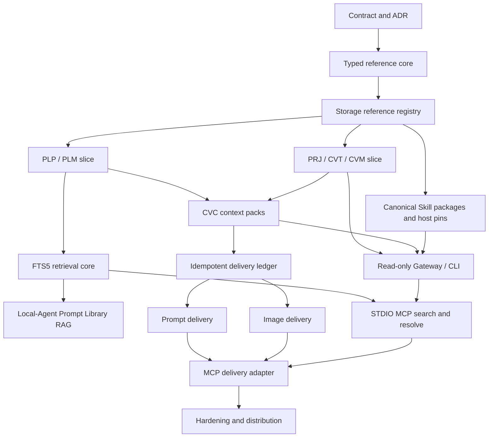

# Plan 008 Execution Plan: Local Reference Bridge, RAG, Skills, And Codex Delivery

> Execution plan for [Plan 008](../../Plan/008-local-mcp-prompt-media-codex-bridge.md). This document converts the long-term product plan into small, ordered, verifiable implementation tasks.

## Status

- Status: `Proposed for review`
- Date: `2026-08-22`
- Branch prepared: `feat/plan-008-contracts`
- Plan 007 prerequisite: manual acceptance confirmed by the user on `2026-08-22`
- Paid live-provider evaluation remains independent and does not block this plan

## Goal

Expose PromptCard's local Prompt Library, Canvas context, and canonical Skill packages to Codex through stable typed references and a repository-owned STDIO MCP adapter, then accept only idempotent additive Prompt/image deliveries back to an explicitly persisted Canvas context.

Do this without replacing the existing pi text Agent, embedding Codex chat in PromptCard, granting direct SQLite/filesystem access, or representing Codex output as a provider generation run.

## Research Summary

### Local architecture findings

The implementation should extend the existing boundaries rather than create a second Agent stack:

- PromptCard Storage is already the authority for projects, Prompt records, assets, Agent conversations, immutable Skill revisions, image runs, and pending placements.
- Gateway already revalidates project scope, Canvas targets, selection digests, attachments, tool permissions, proposal types, and Skill dependencies before and after model invocation.
- text-agent-runtime already compiles a permission-specific policy, but Prompt Library retrieval is still a browser-supplied `200 -> 100` record snapshot with lowercase substring search.
- the current Canvas workspace snapshot is bounded and lossy; it cannot be reused as an immutable `CVC` context pack.
- the existing image placement flow provides the right recovery order: durable pending record, Canvas hydration, project save, then `placed`. Its provider-generation identity must not be reused for Codex delivery.
- the current Skill registry is a useful local-Agent slice, but its `SKL-*` values are internal IDs rather than Plan 008 public ULID reference codes.

Two inferred risks require regression tests before their dependent work:

1. consecutive messages in a newly created Agent conversation may not reuse the Storage conversation ID;
2. a browser retry after a lost response may generate a new request ID and duplicate an already-persisted turn.

These are test-first verification tasks, not assumptions that authorize unrelated refactoring.

### External evidence considered

- [MCP transport specification, 2025-11-25](https://modelcontextprotocol.io/specification/2025-11-25/basic/transports): use STDIO, reserve stdout for JSON-RPC, send logs to stderr, and avoid ambient connection state.
- [SQLite FTS5](https://www.sqlite.org/fts5.html): keep authoritative rows separate from the index, update transactionally, rebuild existing content explicitly, and expose index health.
- [ULID specification](https://github.com/ulid/spec) and [TypeID](https://github.com/jetify-com/typeid): typed prefixes reduce namespace mistakes, while internal primary keys remain separate.
- [Agent Skills specification](https://agentskills.io/specification) and [host implementation guide](https://agentskills.io/client-implementation/adding-skills-support): use progressive disclosure, canonical packages, explicit activation, and host-controlled permissions.
- [Stripe idempotent requests](https://docs.stripe.com/api/idempotent_requests): replay the first result for the same key and request digest; reject reuse of a key with different parameters.
- [What an Anthropic Engineer Thinks About MCP](https://home.mlops.community/public/videos/what-an-anthropic-engineer-thinks-about-mcp) and [One Year of MCP](https://www.latent.space/p/one-year-of-mcp-with-david-soria): prefer explicit state, a small additive tool surface, progressive discovery, and read-heavy initial adoption.
- [Local First FM episode 19](https://www.localfirst.fm/19/transcript): narrow Agent authority by resource and action; preserve an auditable chain of custody.

## Architecture Decisions To Freeze

1. **One authority, several adapters.** Storage owns durable identity and state. Gateway owns policy and orchestration. CLI, MCP, local Agent, and Codex projections are adapters, not alternate databases.
2. **Public code is not a primary key.** Existing IDs remain internal. Every public reference uses `PREFIX-ULID`, is accepted case-insensitively, persisted uppercase, and dispatched by prefix before lookup.
3. **Namespace separation is semantic.** `PLM` and `CVM` may refer to identical bytes but remain different business identities and permission boundaries.
4. **No ambient MCP project.** Every Canvas search, resolve, context, or delivery operation carries an exact `PRJ` or `CVC` reference. UI focus and MCP connection state are never authority.
5. **MCP is STDIO-only in the first release.** Pin one stable MCP protocol/SDK version. Do not add HTTP transport, OAuth, MCP Apps, Sampling, Tasks, or general filesystem tools.
6. **Schema dialect is JSON Schema 2020-12.** Store a language-neutral package at `contracts/promptcard-bridge/v1/`. Add one explicitly declared validator for contract tests instead of relying on a transitive package.
7. **Resolve and Resource share one core.** Exact Tool resolution and any `promptcard://` Resource Template call the same Gateway resolver and permission checks.
8. **FTS before vectors.** Phase 4A starts with SQLite FTS5/BM25, revision/digest freshness, fixed budgets, citations, and audit. Semantic retrieval is a later optional slice that requires explicit provider consent and measured value.
9. **Skill projections are rebuildable.** Storage holds canonical immutable packages and host pins. `.agents/skills` and local-Agent snapshots are derived projections and never become the authority.
10. **Codex delivery has its own ledger.** Reuse asset validation and save-before-placed behavior, but do not reuse provider generation run identity or provenance.
11. **Canonical idempotency name is `clientRequestId`.** The older `deliveryId` example in Plan 008 is treated as illustrative; all additive tool and Gateway contracts use `clientRequestId` plus a normalized request digest.

## Global Constraints

- Work only in the current repository and in-place Git branch; no worktrees, clones, temporary repositories, or project artifacts on `C:`.
- Preserve existing Prompt, project, asset, Agent conversation, and image-generation compatibility.
- Do not add direct MCP access to SQLite, keyring, project JSON, arbitrary local paths, shell, or package-manager execution.
- Search results are discovery records. Every execution request must contain exact typed codes and server-resolved scope.
- Imported Skill content is untrusted data and is never executed during import, preview, indexing, publication, or local-Agent use.
- Browser and model output are untrusted at Gateway boundaries.
- Every migration is idempotent, preserves Trash/restore semantics, and is covered by backup/restore tests.
- Each task leaves the application buildable and testable. No task silently combines refactoring with a feature slice.

## Dependency Graph

## Phase 0: Contract And Decision Freeze

### Task 1: Record the bridge architecture decision

**Description:** Add ADR-018 covering public typed references, the Storage/Gateway/adapter split, separate Codex and local-Agent Skill projections, STDIO ownership, and provider-neutral versus `codex-harness` provenance.

**Acceptance criteria:**

- [ ] ADR explicitly records the eleven decisions above and alternatives rejected.
- [ ] ADR cross-links ADR-008, ADR-012, ADR-016, ADR-017, and Plan 008.
- [ ] The ADR index links ADR-018.

**Verification:** Markdown links resolve; documentation review confirms no claim of implemented runtime behavior.

**Dependencies:** None.

**Files likely touched:** `docs/decisions/ADR-018-local-codex-mcp-contract-boundary.md`, `docs/decisions/README.md`.

**Estimated scope:** Small.

### Task 2: Create the versioned bridge contract package

**Description:** Add the repository-neutral JSON Schema 2020-12 package and manifest for typed references, search results, Prompt bundles, media resources, context packs, Skill packages/revisions/host pins, proposals, deliveries, status, and structured errors.

**Acceptance criteria:**

- [ ] Manifest has one contract version and stable schema IDs consumable by future Gateway, CLI, and MCP adapters.
- [ ] Exact execution inputs accept typed code strings, never search-result objects or internal IDs.
- [ ] Delivery schemas require `clientRequestId`, request digest, exact `CVC`, source-code lists, and additive-only kinds.

**Verification:** Declared JSON Schema validator compiles every schema; `git check-ignore` confirms contract JSON is tracked intentionally.

**Dependencies:** Task 1.

**Files likely touched:** `.gitignore`, `contracts/promptcard-bridge/v1/manifest.json`, `contracts/promptcard-bridge/v1/schema.json`, `contracts/promptcard-bridge/v1/README.md`, package dependency metadata.

**Estimated scope:** Medium.

### Task 3: Add positive and negative contract fixtures

**Description:** Add fixtures for success, unknown code, trashed media, revoked context, invalid Skill package, independent host pins, duplicate requests, digest conflict, revision conflict, namespace mismatch, ULID overflow, and search-result substitution.

**Acceptance criteria:**

- [ ] Every fixture declares its schema entry point and expected validity/outcome.
- [ ] Invalid search-result-as-target, wrong prefix, internal ID, and overflow examples fail formal schema validation.
- [ ] Fixtures distinguish same-key/same-digest replay from same-key/different-digest conflict.

**Verification:** Focused Vitest contract suite passes and reports every fixture by name.

**Dependencies:** Task 2.

**Files likely touched:** `contracts/promptcard-bridge/v1/fixtures/`, `tests/contracts/promptcard-bridge-contracts.test.ts`.

**Estimated scope:** Medium.

### Checkpoint 0: Contracts

- [ ] ADR accepted by the user.
- [ ] Schemas compile under the pinned validator.
- [ ] Positive and negative fixtures pass.
- [ ] No production runtime behavior changed.

## Phase 1: Stable Typed References

### Task 4: Implement the Storage reference-code core

**Description:** Add a standard-library ULID generator/parser with uppercase canonicalization, prefix dispatch, overflow rejection, and typed helpers. Storage is the generation authority; adapters only validate/forward.

**Acceptance criteria:**

- [ ] All seven prefixes parse case-insensitively and render canonically.
- [ ] Invalid alphabet, length, overflow, and namespace mismatch fail with stable error codes.
- [ ] Generation is collision-tested without replacing internal IDs.

**Verification:** Focused Storage unit tests pass with fixed timestamp/random fixtures and collision injection.

**Dependencies:** Checkpoint 0.

**Files likely touched:** `promptcard_storage/reference_codes.py`, `promptcard_storage/tests/test_reference_codes.py`.

**Estimated scope:** Small.

### Task 5: Add the public-reference registry and migration

**Description:** Add schema v10 public-reference registry rows mapping public codes to namespace-scoped internal entities, plus idempotent backfill/reconciliation hooks.

**Acceptance criteria:**

- [ ] Registry enforces code uniqueness, entity uniqueness within its namespace/owner, and required project scope for Canvas entities.
- [ ] Existing active and trashed projects, Prompts, Skills, Prompt media bindings, and Canvas nodes receive stable codes.
- [ ] Re-running migration produces no new codes or payload changes.

**Verification:** Fresh-schema, v9 migration, repeated migration, collision, Trash, and rollback tests pass.

**Dependencies:** Task 4.

**Files likely touched:** `promptcard_storage/store.py`, `promptcard_storage/migration.py`, focused Storage migration tests.

**Estimated scope:** Medium.

### Task 6: Deliver the PLP/PLM exact-resolution slice

**Description:** Persist and resolve Prompt bundle and ordered Prompt-media binding identities without treating `assetId` as the media business identity.

**Acceptance criteria:**

- [ ] Every Prompt resolves by `PLP` with current revision and ordered `PLM` metadata.
- [ ] Rename/archive/restore preserve codes; duplicate/import create or validate independent codes.
- [ ] Missing or trashed media returns exact `PLM`-scoped lifecycle errors.

**Verification:** Storage/API tests cover create, update, media reorder, duplicate, Trash/restore, export/import, and collision.

**Dependencies:** Task 5.

**Files likely touched:** `promptcard_storage/store.py`, `promptcard_storage/app.py`, `promptcard_storage/backup.py`, focused Prompt/media tests.

**Estimated scope:** Medium.

### Task 7: Expose Prompt Library Copy code

**Description:** Add code fields to the frontend client and independent Copy code actions for the Prompt bundle and each media binding.

**Acceptance criteria:**

- [ ] UI copies canonical `PLP` or selected `PLM`, never the internal ID or asset ID.
- [ ] Trashed/restored records preserve the displayed code.
- [ ] Clipboard failure has a visible recoverable state.

**Verification:** Component tests cover Prompt/media targets and clipboard failure; browser smoke verifies copied text.

**Dependencies:** Task 6.

**Files likely touched:** Prompt Library component(s), `src/storage/storage-service-client.ts`, focused frontend tests.

**Estimated scope:** Medium.

### Task 8: Deliver the PRJ/CVT/CVM exact-resolution slice

**Description:** Reconcile project and embedded Canvas node identities into the registry while preserving project JSON as the Canvas authority.

**Acceptance criteria:**

- [ ] Every project has `PRJ`; supported text/image nodes have `CVT`/`CVM` within that project.
- [ ] Duplicate Canvas placement creates a new target code even when bytes are shared.
- [ ] Resolution requires matching `PRJ`, current lifecycle, and bounded node content.

**Verification:** Storage tests cover save/reload, duplicate, node deletion, project Trash/restore, project mismatch, and shared assets.

**Dependencies:** Task 5.

**Files likely touched:** `promptcard_storage/store.py`, `promptcard_storage/app.py`, project normalization/reconciliation tests.

**Estimated scope:** Medium.

### Task 9: Expose project and Canvas Copy code

**Description:** Add Copy project code and typed text/image node code actions without changing existing Agent/image menus.

**Acceptance criteria:**

- [ ] Project UI copies `PRJ`; node menu copies the correct `CVT` or `CVM`.
- [ ] Unsupported/running/transient nodes explain why no code is available.
- [ ] Copy actions do not switch the right workspace or mutate selection content.

**Verification:** Component and Playwright tests cover text node, image node, project code, and unsupported state.

**Dependencies:** Task 8.

**Files likely touched:** Canvas action components, `FreeCanvasBuilderScreen.tsx`, Storage client/types, focused tests.

**Estimated scope:** Medium.

### Checkpoint 1: Stable identities

- [ ] PLP/PLM/PRJ/CVT/CVM exact resolution is indexed and bounded.
- [ ] Rename/restore preserve codes; duplication creates codes.
- [ ] Backup/restore and import collision tests pass.
- [ ] Full Storage, frontend, and build gates pass.

## Phase 2: Immutable Canvas Context Packs

### Task 10: Persist CVC context packs

**Description:** Add immutable, project-scoped CVC snapshots with selected node codes/revisions, bounded text, source references, placement hint, creator, and revocation state.

**Acceptance criteria:**

- [ ] Creation requires explicit supported selection and current `PRJ` revision.
- [ ] Snapshot remains stable after focus/selection changes and never copies media bytes or absolute paths.
- [ ] Revocation blocks future resolve without deleting project content.

**Verification:** Storage tests cover create/resolve, empty selection, unsupported nodes, project mismatch, missing media, and revocation.

**Dependencies:** Checkpoint 1.

**Files likely touched:** `promptcard_storage/store.py`, `promptcard_storage/app.py`, CVC-focused tests.

**Estimated scope:** Medium.

### Task 11: Add Copy Codex context UI

**Description:** Add selection preview, explicit creation/copy, inspection, and revocation while reusing existing typed Canvas selection.

**Acceptance criteria:**

- [ ] User sees included nodes/references before creating the pack.
- [ ] No selection is disabled; no implicit whole-Canvas option is introduced.
- [ ] Copied `CVC` resolves the same snapshot after project focus changes.

**Verification:** Component tests and Playwright cover preview, copy, focus change, inspect, revoke, and clipboard failure.

**Dependencies:** Task 10.

**Files likely touched:** new context-pack UI component, `FreeCanvasBuilderScreen.tsx`, Storage client/types, focused tests.

**Estimated scope:** Medium.

### Checkpoint 2: Explicit context

- [ ] CVC is immutable, inspectable, revocable, and bounded.
- [ ] No UI focus or MCP session is required to resolve it.
- [ ] Manual acceptance confirms copied context contents and placement hint.

## Phase 3: Canonical Skill Registry And Host Projections

### Task 12: Store complete immutable Skill packages

**Description:** Extend the current instruction/reference slice to canonical package entries, public `SKL`, revision digest, provenance, lifecycle, and declared capabilities without executing package content.

**Acceptance criteria:**

- [ ] Canonical digest covers normalized relative paths and bytes.
- [ ] Public `SKL` remains stable across revisions; internal legacy IDs remain readable.
- [ ] Scripts/assets/references are stored as inert typed package entries.

**Verification:** Storage tests cover revision immutability, digest stability, archive, identity collision, and legacy migration.

**Dependencies:** Task 5.

**Files likely touched:** Skill Storage modules/schema, API models, focused tests.

**Estimated scope:** Medium.

### Task 13: Implement safe folder/archive inspection

**Description:** Inspect packages without execution and reject traversal, unsafe links, duplicate normalized paths, excessive size/count, malformed frontmatter, credentials, and unsupported entries.

**Acceptance criteria:**

- [ ] Import never runs scripts, hooks, installers, or package managers.
- [ ] Validation findings are structured and reviewable before persistence.
- [ ] Failed import leaves no canonical revision or host projection.

**Verification:** Security fixture suite covers traversal, symlink/junction, archive bombs, duplicates, malformed metadata, and no-execution probes.

**Dependencies:** Task 12.

**Files likely touched:** new Skill importer/validator modules and security tests.

**Estimated scope:** Medium.

### Task 14: Add independent host pins and projections

**Description:** Persist independent Codex/local-Agent enablement and pinned revision, generate repository-scoped Codex projections, and keep local-Agent snapshots Gateway-bounded.

**Acceptance criteria:**

- [ ] Enabling/updating one host never changes the other host pin.
- [ ] Codex projection manifest records `SKL`, revision, digest, and owner; collision and drift fail visibly.
- [ ] Local Agent receives only allowed instructions/resources and cannot gain tools.

**Verification:** Storage/Gateway tests cover independent pins, republish, drift, unavailable revision, and tool-scope rejection.

**Dependencies:** Tasks 12-13.

**Files likely touched:** Skill host-pin Storage/API, projection adapter, Gateway snapshot resolver, focused tests.

**Estimated scope:** Medium.

### Task 14 Technical Acceptance Gate

This is an additional human-review stop before Task 15. Do not begin the Skill Hub management UI until the user accepts the Task 14 evidence package.

- [x] Codex and local-Agent enablement/pins are independent and bind the exact canonical `SKL`, revision, and digest.
- [x] Concurrent publish/publish and publish/unpublish operations, database failure, and process restart cannot leave the durable pin and repository projection silently divergent.
- [x] Codex collision, full-manifest drift, missing files, extra files, unsafe paths, and symlink/junction/reparse escape fail visibly without overwriting or deleting user-owned content.
- [x] Local-Agent resolution rechecks lifecycle and trust for every run, filters scripts and disallowed resources, enforces fixed content/capability budgets in both Storage and Gateway, and cannot add tools beyond the validated run scope.
- [x] Focused adversarial tests and the full Storage, Gateway/backend, Ruff, TypeScript, and production-build gates pass.
- [x] The acceptance handoff lists commits, automated evidence, remaining risks, and the exact manual/API probes available before Task 15.

### Task 15: Complete Skill Hub management UI

**Description:** Add import review, revision diff/history, archive, trust findings, and independent host controls to the existing inspection screen.

**Acceptance criteria:**

- [ ] UI clearly separates canonical revision, Codex projection, and local-Agent pin.
- [ ] Update does not silently move either pin.
- [ ] Invalid/drifted/archived states expose recovery actions without executing content.

**Verification:** Component and browser tests cover import, validation failure, revision update, independent pins, drift, and archive.

**Dependencies:** Task 14.

**Files likely touched:** `SkillHubScreen.tsx`, Storage client/types, new import/detail components, focused tests.

**Estimated scope:** Medium.

### Checkpoint 3: Skills

- [ ] One canonical revision can feed both hosts with independent pins.
- [ ] Import and preview prove no execution.
- [ ] Drift/collision are explicit and recoverable.
- [ ] Folder and archive imports expose structured findings and inert previews before persistence; scripts, hooks, installers, and package managers remain unexecuted.
- [ ] A user can keep Codex on one revision and local Agent on another, then move either host without silently changing the other.
- [ ] Manually modifying or deleting an owned Codex projection produces visible drift, and explicit republish restores it without changing the canonical package.
- [ ] An unowned publication-name collision is preserved; choosing a different publication name recovers without overwriting the existing directory.
- [ ] Archive, restore, publish/unpublish, and enable/disable states remain distinct and expose valid recovery actions.
- [ ] Component, browser, Storage, Gateway, security, TypeScript, and production-build gates pass.
- [ ] Stop for user acceptance of the Skill Hub workflow and evidence package before beginning Task 16.

## Phase 4: Read-Only Gateway, CLI, Retrieval, And MCP

### Task 16: Expose bounded read-only Gateway operations

**Description:** Add runtime describe and exact project/library/canvas/context/Skill resolve/search endpoints using the contract package and existing Gateway permission checks.

**Acceptance criteria:**

- [ ] Namespace/project/lifecycle errors remain distinct and structured.
- [ ] Responses expose no paths, credentials, unrestricted metadata, or full project JSON.
- [ ] Search cannot be accepted by any execution endpoint.

**Verification:** Gateway contract tests cover every scope, reference type, redaction, bound, and offline error.

**Dependencies:** Checkpoints 2-3.

**Files likely touched:** new Gateway bridge contracts/router/service and focused tests.

**Estimated scope:** Medium.

### Task 17: Add deterministic repository JSON CLI

**Description:** Build a Node/TypeScript CLI that invokes the Gateway read contracts and emits exactly one JSON result to stdout, diagnostics to stderr, and stable exit codes.

**Acceptance criteria:**

- [ ] CLI supports runtime describe and every exact resolve before search.
- [ ] Same inputs produce contract-equivalent CLI/Gateway output.
- [ ] CLI never reads SQLite or local media paths directly.

**Verification:** CLI contract tests cover success, unknown/offline codes, redaction, exit codes, and stdout purity.

**Dependencies:** Task 16.

**Files likely touched:** new `promptcard-bridge-cli/` package, package scripts, contract tests.

**Estimated scope:** Medium.

### Task 18: Add the transactional FTS5 retrieval core

**Description:** Create normalized Prompt retrieval documents, external-content FTS5/BM25 indexes, lifecycle triggers, explicit rebuild, deterministic ranking, fixed budgets, freshness re-resolution, health, and audit records.

**Acceptance criteria:**

- [ ] Prompt writes and lexical index updates are transactionally consistent; existing rows rebuild explicitly.
- [ ] Trash is excluded and stale revision/digest candidates cannot reach a host.
- [ ] Results include identity, revision, matched fields, score components, reason, and bounded safe media metadata.

**Verification:** Storage tests cover create/update/archive/restore, rebuild, induced drift, Chinese/English queries, ranking stability, and fixed result/evidence budgets.

**Dependencies:** Task 6.

**Files likely touched:** new retrieval module/schema, Storage integration, diagnostics API, focused tests.

**Estimated scope:** Medium.

### Task 19: Prove Agent conversation durability prerequisites

**Description:** Add regression tests for new-conversation continuation and response-loss retry. Make the smallest correction only if the tests reproduce the inferred risks.

**Acceptance criteria:**

- [ ] Two consecutive messages reuse one Storage conversation.
- [ ] Retrying a lost response can reuse the original request ID and returns the saved turn.
- [ ] Ordinary failure behavior and existing conversation hydration remain compatible.

**Verification:** Focused store/UI/Gateway tests pass before and after any correction.

**Dependencies:** Before Task 20.

**Files likely touched:** `AgentCollaborationPanel.tsx`, `agent.store.ts`, Gateway conversation tests, focused frontend tests.

**Estimated scope:** Small if confirmed; no production diff if disproved.

### Task 20: Replace browser Prompt snapshots with local-Agent RAG

**Description:** Send query, conversation, filters, and exact codes only; retrieve bounded evidence in Gateway/Storage; inject citations and persist retrieval audit.

**Acceptance criteria:**

- [ ] Browser sends no Prompt array and runtime receives at most the fixed evidence budget.
- [ ] Only explicit Prompt Library RAG modes receive the retriever/evidence.
- [ ] Citations resolve to current Prompt identities; lexical degraded state is visible and auditable.

**Verification:** Frontend/Gateway/runtime tests prove no snapshot transport, mode isolation, citation rendering, stale rejection, and disabled-RAG fallback.

**Dependencies:** Tasks 18-19.

**Files likely touched:** Agent store/service, Gateway runtime path, text-agent policy/tools, retrieval/citation UI, focused tests.

**Estimated scope:** Medium, implemented as two reviewable commits if file count exceeds five.

### Task 21: Add repository-owned read-only STDIO MCP

**Description:** Wrap the same Gateway operations with the pinned official MCP SDK; expose small read Tools and optional exact `promptcard://` Resources sharing the same resolver.

**Acceptance criteria:**

- [ ] stdout contains JSON-RPC only; logs and diagnostics use stderr.
- [ ] Process inherits a minimal allowlisted environment and has no SQLite/shell/general-filesystem tool.
- [ ] CLI, MCP, and Gateway outputs pass the same fixtures and schema package.

**Verification:** MCP protocol tests cover initialization, tool schemas, Resource/Tool equivalence, offline behavior, process cleanup, and no network dependency download at startup.

**Dependencies:** Tasks 16-18.

**Files likely touched:** new `promptcard-mcp/` package, launcher/config, contract tests.

**Estimated scope:** Medium.

### Task 22: Reuse retrieval in MCP search

**Description:** Connect Prompt Library MCP search to the same FTS core without sharing Agent conversations, permissions, credentials, or audit IDs.

**Acceptance criteria:**

- [ ] Exact codes short-circuit before ranking.
- [ ] MCP search returns compact typed results and its own operation audit.
- [ ] Agent and MCP ranking fixtures match while permissions/audits remain distinct.

**Verification:** Cross-adapter contract tests cover exact/search paths, bounded output, namespace isolation, and concurrent index changes.

**Dependencies:** Tasks 18, 21.

**Files likely touched:** MCP adapter, Gateway bridge service, retrieval audit tests.

**Estimated scope:** Small.

### Checkpoint 4: Read bridge and RAG

- [ ] Browser Prompt snapshots are removed from RAG mode.
- [ ] CLI/MCP/Gateway share schemas and exact resolvers.
- [ ] Ordinary Agent/Canvas/image workflows work with MCP absent.
- [ ] Full frontend, Storage, Gateway, runtime, build, and MCP contract gates pass.
- [ ] Local-Agent RAG resolves bounded canonical retrieval records rather than accepting browser-supplied Prompt snapshots as authority.
- [ ] CLI, MCP, and Gateway return contract-equivalent exact-resolution results and share retrieval records/ranking without sharing conversations, audit ownership, or permissions.
- [ ] Namespace, project scope, lifecycle, unavailable-resource, and retrieval-unavailable outcomes remain distinct, structured, and redacted.
- [ ] MCP can be stopped or omitted while ordinary Agent, Canvas, Prompt Library, and image-generation workflows continue to work.
- [ ] User acceptance covers representative exact resolve, search ranking/evidence, offline behavior, and permission-isolation scenarios before Task 23.

## Phase 5: Idempotent Additive Delivery

### Task 23: Add the Codex delivery ledger

**Description:** Persist host/profile/operation/`clientRequestId`, normalized digest, exact target/source manifest, state, result, and timestamps before implementing Prompt or image delivery.

**Acceptance criteria:**

- [ ] Same key plus same digest returns the first result/status.
- [ ] Same key plus different digest returns `delivery_conflict`.
- [ ] Validation failures before processing do not create a completed operation; crash recovery can reconcile `processing`.

**Verification:** Storage state-machine tests cover replay, conflict, crash, retry, stale/revoked CVC, and long-term deduplication.

**Dependencies:** Task 10 and contract fixtures.

**Files likely touched:** delivery Storage module/schema, API, focused tests.

**Estimated scope:** Medium.

### Task 24: Deliver additive Prompt proposals

**Description:** Create a pending `free_canvas_text_create` proposal against exact CVC placement, preserving source codes and approval semantics without replacing project JSON.

**Acceptance criteria:**

- [ ] Proposal targets the resolved project/context and contains bounded content/provenance.
- [ ] Repeated request creates no duplicate proposal/node.
- [ ] Apply uses the existing save coordinator; reject leaves an auditable terminal result.

**Verification:** Gateway/Storage/frontend tests cover pending, apply, reject, save conflict, replay, and unavailable context.

**Dependencies:** Task 23.

**Files likely touched:** bridge delivery service, proposal Storage/API, Canvas proposal integration, focused tests.

**Estimated scope:** Medium.

### Task 25: Deliver additive images with codex-harness provenance

**Description:** Accept multipart bytes through Gateway, validate/localize with the existing asset pipeline, and create a Codex-specific pending placement using the existing save-before-placed protocol.

**Acceptance criteria:**

- [ ] Gateway rejects paths/URLs, MIME spoofing, oversized images, wrong context, and missing scope before placement.
- [ ] Asset/DB partial failures remain durable and recoverable without duplicate assets/nodes.
- [ ] Provenance is `codex-harness`; no provider generation run is created.

**Verification:** Multipart, asset, Storage, frontend recovery, replay, crash, and source-manifest tests pass.

**Dependencies:** Task 23.

**Files likely touched:** Gateway multipart route/service, Codex placement Storage/API, Canvas placement reconciliation, focused tests.

**Estimated scope:** Medium.

### Task 26: Expose MCP delivery and status tools

**Description:** Add Prompt propose, image deliver, and delivery get Tools that validate workspace-local input paths inside the adapter, upload bytes, and forward exact contracts to Gateway.

**Acceptance criteria:**

- [ ] Adapter resolves the real path under an allowed workspace root and rejects traversal/symlink/junction escape.
- [ ] Write Tools require exact CVC/source codes and never accept search queries as targets.
- [ ] Status polling never repeats the mutation.

**Verification:** MCP tests cover valid workspace file, path escape, duplicate request, digest conflict, pending recovery, and stdout purity.

**Dependencies:** Tasks 21, 24-25.

**Files likely touched:** MCP delivery tools/path policy, contract tests.

**Estimated scope:** Medium.

### Checkpoint 5: Delivery

- [ ] Prompt and image delivery are additive, idempotent, recoverable, and correctly scoped.
- [ ] No Codex output is recorded as a provider generation run.
- [ ] Repeating every E2E delivery creates exactly one durable result.
- [ ] The delivery ledger persists processing intent before any Prompt or Canvas mutation, and retry/restart reconciles interrupted operations without duplicate results.
- [ ] Exact CVC, project, source-code, and workspace-file scopes are enforced; search results and arbitrary paths cannot become write targets.
- [ ] Prompt delivery creates reviewable additive proposals, while image delivery records `codex-harness` provenance and never fabricates provider-run history.
- [ ] Replaying the same `clientRequestId` and digest returns the first result; reusing the key with a different digest returns an explicit conflict.
- [ ] User acceptance covers success, duplicate replay, digest conflict, failure/retry, restart recovery, and out-of-scope rejection before Task 27.

## Phase 6: Hardening And Distribution

### Task 27: Run the adversarial boundary suite

**Description:** Add end-to-end negative coverage across reference, Skill, retrieval, MCP, multipart, and delivery boundaries.

**Acceptance criteria:**

- [ ] Tests cover cross-project IDOR, namespace mismatch, revoked CVC, archived Skill, stale pins, traversal/junction/symlink escape, MIME spoofing, duplicate delivery, crash replay, and Skill attempts to expand authority.
- [ ] Responses redact paths, credentials, raw provider bodies, and internal exceptions.
- [ ] MCP/Agent outages leave ordinary PromptCard workflows functional.

**Verification:** Full automated matrix passes with no secrets, open ports, orphan processes, or unexpected network calls.

**Dependencies:** Checkpoint 5.

**Files likely touched:** contract/security/E2E test suites and test fixtures only unless defects are found.

**Estimated scope:** Medium.

### Task 28: Package and document the optional bridge

**Description:** Add locked launchers, configuration, diagnostics, supported-host documentation, provenance/cost caveats, and contributor verification commands.

**Acceptance criteria:**

- [ ] New contributor can enable read-only MCP without provider keys or runtime downloads at launch.
- [ ] Documentation distinguishes discovery, resolution, generation host, delivery, Storage, and Canvas failures.
- [ ] Disabling/removing MCP leaves PromptCard local workflows and data readable.

**Verification:** Clean local install/start smoke, launcher tests, documentation link check, build, and full regression suite pass.

**Dependencies:** Task 27.

**Files likely touched:** launch scripts, README/architecture/API docs, package metadata, launcher tests.

**Estimated scope:** Medium.

## Final Acceptance Matrix

- [ ] `PRJ/PLP/PLM/CVT/CVM/CVC/SKL` codes are stable, exact, indexed, and namespace-safe.
- [ ] CVC remains stable across UI focus changes and can be revoked.
- [ ] Canonical Skill revisions feed Codex and local Agent through independent pins.
- [ ] Local-Agent RAG and MCP search share retrieval records/ranking but not conversations or permissions.
- [ ] CLI/MCP/Gateway produce contract-equivalent results.
- [ ] Prompt and image delivery are additive, idempotent, recoverable, and provenance-correct.
- [ ] PromptCard works normally when MCP/Codex/retrieval extras are absent.
- [ ] Full frontend, Storage, Gateway, text-runtime, MCP/CLI, build, browser, security, and documentation gates pass.

### Final Human Acceptance Gate

- [ ] The adversarial suite covers cross-project IDOR, namespace mismatch, revoked CVC, archived Skill, stale pins, traversal/junction/symlink escape, MIME spoofing, duplicate delivery, crash replay, and Skill attempts to expand authority.
- [ ] Errors and diagnostics redact local paths, credentials, raw provider bodies, model secrets, and internal exceptions.
- [ ] A new contributor can enable and diagnose the read-only bridge without provider keys or runtime downloads at launch.
- [ ] Disabling or removing MCP/Codex/retrieval extras leaves PromptCard local workflows and stored data readable.
- [ ] Clean-start smoke tests, launchers, documentation links, browser acceptance, and every automated release gate pass.
- [ ] Stop for final user acceptance; release handoff must state supported hosts, optional components, provenance/cost caveats, known limitations, and rollback/removal steps.

## Execution Rules

- Implement tasks sequentially unless a checkpoint explicitly exposes independent test/documentation work.
- Use test-first development for migrations, resolvers, retrieval freshness, idempotency, and security boundaries.
- Commit one task or one tightly coupled vertical slice at a time; do not mix cleanup.
- Stop for human review at the Task 14 Technical Acceptance Gate, Checkpoints 3/4/5, and the Final Human Acceptance Gate. Do not begin the next gated phase until the user accepts the evidence package.
- Any new dependency must be pinned, justified against existing stack capability, and reviewed for startup/network behavior.
- Semantic embeddings, HTTP MCP, auto Skill matching, script execution, whole-Canvas context, and update/delete Canvas tools require separate accepted follow-up plans.

## Open Questions To Resolve At Checkpoints

1. Checkpoint 0: approve the canonical `clientRequestId` name and JSON Schema validator dependency.
2. Checkpoint 1: approve which transient/running Canvas node kinds receive no public code.
3. Checkpoint 2: approve CVC retention as indefinite-until-revoked for the first release.
4. Checkpoint 3: approve whether first import supports both folder and archive or folder first.
5. Checkpoint 4: approve the fixed FTS top-k/evidence budget after retrieval evaluation.
6. Checkpoint 5: choose Apply-required versus trusted-profile auto-place; default plan remains Apply-required.
